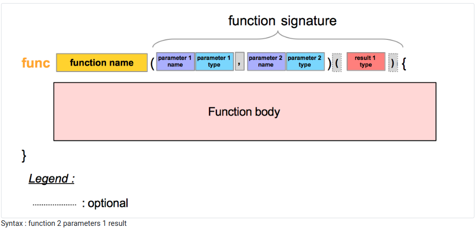

# Functions

## 1. What is a function

### 1.1. Definition

A function is a block of code invoked by a specific name. It may receive input values. It may also output values.

### 1.2. Vocabulary

Let’s introduce important terms :

- When we create a function, we say that we define it.

- The input values are the function parameters.

- The output values are the function results.

- When we use a function, we say that we call it.

- A function usage is called a function call.

## 2. Why do we need them?

### 2.1. Reusability
With functions, you can write a block of complex code once and then use it several times in your application.

### 2.2. Use code from other developers

In your go program, you can use functions written by other programmers :

- From the Go standard library

- From projects published by Go developers

We will see how to do both in the next sections.

### 2.3. Abstraction

This is what we did in the previous blocks of code we wrote when we called the function Println from the fmt package. When you call Println, you call a massive block of code. This block of code is not visible to the caller of the function. It’s hidden. And this is a great thing! We do not need to know the function internals to use it. Functions bring a level of abstraction.

Functions are like black boxes; implementation details are hidden from the caller.

## 3. Parameters and results

A function can be seen as a machine; it takes input, performs an action And it outputs something.

## 4. Number of parameters, number of results 

The number of **parameters** may vary from 0 to N. Technically speaking, N can be 100 or even 1000.

It’s not a good practice to define a lot of parameters.

In my opinion, a function should not have more than three parameters.
The number of **results** may also vary from 0 to N.

My recommendation is to limit yourself to 2 results.

## 5. Return statement

A return statement begins with the keyword return. The return statement is used in a function to :

- Terminate the execution of the function

- Optionally provide the results of the function

We will see in concrete examples how to use the return statement.

## 6. A standard function: 2 parameters, one result



## 7. Scope of a function

Each function has a scope. A function’s scope begins with the opening curly brace { and stops with the closing curly brace }. A scope is a portion of the source code. This is an extent of the source code.

They can be used only in the scope of the function. After the closing curly brace, they do not exist. The parameters only exist in the scope of the function.

## 8. The main function

The first function that we used was the main function. The main function (from the main package) has no parameters and no result. This is the entry point of a program.

```go
package main

func main() {

}
```

## 9. Bits of Advice

1. Functions names should express clearly the operation that will be executed by the function

- Avoid names with one letter

- Use camel case

- No more than two words

2. Parameters and results names should also convey information. Follow the same advice given before.

3. Avoid mentioning the type in the identifier.

4. Choose the parameter types and the return types carefully. Well-chosen types improve the readability of your code.

## 10. Test yourself

1. A function should have at least one parameter. True or False?

- False

- A function can have 0 parameter.

2. In a function, what is the purpose of a return statement?

- A return statement stops the execution of the function.

- It also optionally provide one or more result values

3. What is the difference between the result(s) list and the parameter(s) list ?

- They are both lists of identifiers and types

- The result(s) list is the output of the function, what the function will return when it’s called

- The parameter(s) list is the input of the function. The inner logic of the function will use input parameters

4. Can we write Go programs without functions?

- You can, but you will need at least a main function to start your program.

- Functions are a great tool to build programs; you may see them as machines that can be called everywhere.

5. Fill the blank: To launch a function, I need to ____ it.

- call

6. When I define a function, it will be launched at the beginning of my program. True or False?

- This is false

- The act of defining a function is different from calling a function.

- A function will be executed when it’s called.

## 11. Key takeaways

- Functions are convenient building blocks of programs

- A function is like a “machine” :

    - Designing / Building the machine => define the function

    - Start the machine => call the function

- Give your functions meaningful and short names

- Functions may have

    - Parameters: input

    - Results: output

- The return statement terminates the execution of the function and optionally provide results to the caller1.

