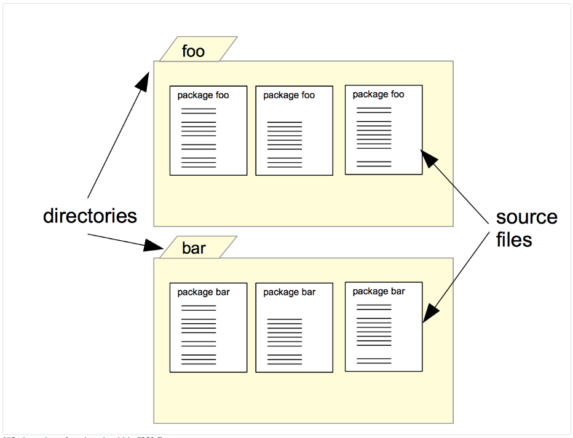
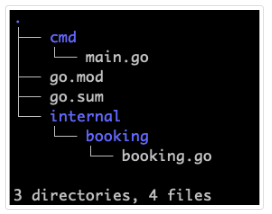

# Packages and imports

## 1. Layouts

- package

- source file

- import

- module

- modular programming

## 2. Program, package, source files

A Go program is a combination of packages 


A package is composed of one or more source files. Into those source files, the Go programmer declares :

- constant

- variables

- functions

- types and methods

The package main is often composed of an individual file. The function main is the program entry point. In a Go program, you will also find a file named go.mod. The following sections will detail all those components.


## 3. Source files


The following snippet is an example of a source file that belongs to a package occupancy :

```go
// package-imports/occupancy/occupancy.go
package occupancy

const highLimit = 70.0
const mediumLimit = 20.0

// retrieve occupancyLevel from an occupancyRate
// From 0% to 30% occupancy rate return Low
// From 30% to 60% occupancy rate return Medium
// From 60% to 100% occupancy rate return High
func level(occupancyRate float32) string {
    if occupancyRate > highLimit {
        return "High"
    } else if occupancyRate > mediumLimit {
        return "Medium"
    } else {
        return "Low"
    }
}

// compute the hotel occupancy rate
// return a percentage
// ex : 14,43 => 14,43%
func rate(roomsOccupied int, totalRooms int) float32 {
    return (float32(roomsOccupied) / float32(totalRooms)) * 100
}
```

### 3.1. Package clause

At the top of the source file, we find the package clause in our example, it’s :

> package occupancy

The package clause is the first line of each source file. It defines the name of the current package.

### 3.2. Imports declaration

Then the **set of imports declarations**. In this section of the source file, we define all the other packages that we want to use in this package. The package occupancy does not import other packages. Let’s take another example: here is a source file from the package room :

```go
// package-imports/import-declaration/room/room.go
package room

import "fmt"

// display information about a room
func printDetails(roomNumber, size, nights int) {
    fmt.Println(roomNumber, ":", size, "people /", nights, " nights ")
}
```

Here we import one package :

- **fmt** which is part of the standard library

### 3.3. Source code

After the imports declarations, we find the most important part, the source code of the package. This is where you can declare variables, constants, functions, types, and methods.

## 4. File organization

We must group the source files of a package into a single directory. The directory must have the same name as the package. For instance, the source files of the baz package must be stored into the baz folder



## 5. The main package

A Go program starts by initializing the main package and then run the function main from that package. The main package is where your program starts doing what it was built to do.

Here is an example of a main package :

```go
// package-imports/main-package/main.go
package main

import "fmt"

func init() {
    fmt.Println("launch initialization")
}

func main() {
    fmt.Println("launch the program !")
}
```
This program has an init function. This function can hold all the initialization tasks necessary for your program to run correctly (for more information about it, refers to the dedicated chapter).

The program also defines a main function. Both functions do not have a return type (unlike C, where the main function must return an integer).

The main function will be executed after all the initialization tasks have been performed. In this function, you usually call other packages and implement your program logic.

The previous program output :

```go
launch initialization
launch the program!
```

The init function is launched, then the main function.

### 5.1. One main package per project?

This is not always the case, but a project can have several main packages and thus several main functions. Usually, different main packages are present in large projects. Here are some common examples :

- A main package for launching the web server of the application

- Another main package to run scheduled database maintenance

- Another one that has been developed for a specific punctual intervention...

For instance, the Kubernetes (one of the most starred Go projects) holds at the time of speaking 20 main packages.

### 5.2. Should I name the file that holds my main package main.go?

No, it’s not an obligation. You can do that if you have just one main function in your project. But often, it’s good practice to give it an informational name.

For instance, in the project Kubernetes you can find the following files that are holding a main package :

- check_cli_conventions.go

- gen_kubectl_docs.go

We can infer what the program does just by looking at its name: the first one will check that CLI conventions are respected, the second one will generate docs.

Please follow this convention. It allows other developers to understand what the program does by looking at the file tree.

### 5.3. Our main packages stored in a specific directory

Again nothing is written in the Go specification about the folder that should contain the main package. There is still a strong usage main packages should live inside a cmd/ folder at the root of the repository.

## 6. The go.mod file

Here is an example of a go.mod file :

```go
module maximilien-andile.com/myProg

go 1.13
```

### 6.1. Module path

The first line is composed of the word module followed by the module path.

We introduce here the notion of module. They have not always existed in Go; they have been introduced around March 2019. We will detail what modules are and how to use them in another section. For the moment, remember that a module is “a collection of Go packages stored in a file tree with a go.mod file at its root”. When we add a package main to a module, we make it a program that can be compiled and executed.

We need to define a module path for our module (our program). The path is the unique location of the module. Here are some examples of paths for two famous Go programs.

- Hashicorp Vault
> module github.com/hashicorp/vault
- Kubernetes
> module k8s.io/kubernetes

"github.com/hashicorp/vault" is an URL to a Github repository. A Github repository is a folder that contains the source code of a project. This folder can be publicly accessible (i.e., by anyone who has the link) or private. In the latter case, the code is only accessible to authorized developers. If you have access to a repository that has a go.mod inside, you can import it in your project. We will see later how that works.

Note that your program will not be automatically shared or exposed by Go if you choose a remote path! For testing purpose, you can choose a path that is not an URL :

```go
module thisIsATest

go 1.13
```

### 6.2. Expected Go version

The next line of the go.mod file declares Go’s expected version. In this program, version 1.13 of go is expected. By setting it, we say to other developers that our project has been developed with this specific version of Go. In 10 years, Go will evolve, and some stuff that we use now in our program will probably not exists anymore. Programmers from the future will know how to compile it.

```go
|----go.mod
|----main.go
|----occupancy
|   |----occupancy.go
|----room
    |----room.go
```

The program is composed of 2 directories (in bold) :

- occupancy

- room

Each directory is composed of a go file. The file has the name of the directory. Each folder represents a package.

## 7. Modular programming

Those questions are not new to software engineering and have been asked by many programmers before. During the sixties, software developers were struggling to maintain code bases. Softwares were designed into a single monolith with intensive usage of GOTO statements. The codebase of some projects became hard to understand due to this design.

The community needed a better way to develop. This was the beginning of the reflection on modular programming.

### 7.1. What is a module?

To define a module, we will use Gauthier’s standard definition. A module is a chunk of code that :

- Performs a specific task

- With inputs and outputs well defined

- That can be tested independently

A large project that requires to perform several tasks can be split into different tasks, each one living inside a module with a well-defined API (2) and that can be tested independently from other systems.

## 7.2. Expected benefits of modular programming

If you build your systems by using modules, you can make your team work on different modules independently, it increases the expected productivity of the team members. For instance, you are positioning two developers on module A and two others on module B. The two groups will not block each other if you have clearly defined the API of the two modules. Modules can also be implemented by others even if they are not finished yet.

Modules increase the flexibility of development. You can ship isolated features into modules without having to do heavy changes on the existing code base of your system.

Developers can easily understand code organized in modules. A large system with a lot of structures, interfaces, and files is hard to understand. Joining a project that has thousands of files is hard. A system composed of modules requires less energy to be understood, modules can be studied iteratively. Modularity facilitates the system comprehension by developers (especially newcomers to the team)

### 7.3. How to decompose a program into modules

Decomposition of a system into modules can be difficult. There is no unique answer to this issue. Here is some advice that is based on experience and my readings :

- Do not create a module for every single task of a system; you will end up with too many modules with a size that is too small.
- Instead, create modules that group functionalities that are close, for instance, a module for handling the database queries, a module to handle logging.
- Inside your modules, the code is usually tightly coupled, meaning that the different parts of your module are strongly linked.
- Between two modules, you should enforce loose coupling. Each module is treated as a component, and each component do not need another component to work. Modules should be independent. It allows you to replace one module with another one without touching the other modules.

## 8. Modular programming / Go modules / Go packages

We introduced three notions :

- Modular programming

- Go packages

- Go modules

Those three notions are linked together. Modular programming is a way of writing programs. The developer should create testable chunks of codes that perform specific tasks with a well-defined output and output. This “method” can be applied in C, Java, C++, Go...

- **Go packages** are a tool that you can use to write modular programs. In a Go package :

    - We can group source files with functions (or methods) related to a particular functionality :

        - Ex: a package booking that will handle bookings for the hotel: create a booking, confirm a booking, cancel a booking...

        - Ex: a package room that will group functions related to hotel rooms: display the room information, check its current occupancy...

    - We can write tests that we can run independently of the rest of the code. (we will see how to do it in the unit test chapter)

- **Go modules** are a way of grouping packages together to form an application or a library.

## 9. Package naming convention

Finding a good name for a package is important. Other developers will use the package name in their source code, as a consequence, it must be informative but also shorts. A lot of blog articles have been written about this subject. In this section, I will give you some hints to choose your package name wisely :

The name you choose must be small. In my opinion, no more than ten letters is a good length. Take an example from the standard library. Package names are very shot, often composed of a single word.

Package names can be written in snake case (my_name) nothing in the specification is written about it, but the usage among the Go community is to use camel case (myPackageName)

### 9.1. The uniqueness of package names

Such small names often disconcert beginners because they fear from potential name collisions. The risk of collision exists but not at the level of the package name :

- The import path **AND** the package name must be unique.
Another developer might have taken foo as a package name does not prevent me from choosing it because my package has not the same import path.

- Note that if someone has the same import path as you and the same package name, you can still compile your program

## 10. Linking package together: a trial and error approach

In the previous chapter, all the code we produced was in the main package. We know how to create new packages that will contain functions, variables, constants... How to use functions from the package room into the package main?

Here is our package room :

```go
// package-imports/trial-error/room/room.go
package room

import "fmt"

// display information about a room
func printDetails(roomNumber, size, nights int) {
    fmt.Println(roomNumber, ":", size, "people /", nights, " nights ")
}
```
Here is our main function :

```go
// package-imports/trial-error-3/main.go
package main

import "thisIsATest2/room"

func main() {
    room.printDetails(112, 3, 2)
}
```
If we compile, we got another error :

```go
./main.go:6:2: cannot refer to unexported name room.printDetails
./main.go:6:2: undefined: room.printDetails
```

It gives us an indication: we are unable to call the function because it’s unexported... We need to export the function to make it visible to others! To do that in Go, you have to use a capital letter on the first letter of the function.

### 10.1. Key Takeaways

- A function, a variable, and a constant if **not exported** is **private** to the package where it is defined

- To **export something** just transform the first letter of its identifier to a capital letter

## 11. Import Path & Import declaration

To import a package into another package, you need to know its import path. We will see how to determine it in the first section.

When you know the import path, you have to write an import declaration. This is the object of the next section.

### 11.1. Import path

The Go specifications do not strictly specify the import path. The import path is a string that must uniquely identify a module among all the existing modules. The build system will use them to fetch the source code of your imported packages and build your program. Today the Go build system (which code live in the package go/build rely on different types of path :
- Standard library path

    - The source files that we will use to build your program are located by default in /usr/local/go/src (for Linux and Mac users) and in C:\Go\src for windows users
- URL that points to a code-sharing website.
    - Go has out-of-the-box support for the following code-sharing websites that use Git as a version control system (VCS): Github, Gitlab, Bitbucket.
    - The URL can be exposed on the internet (for instance, an open-source project hosted on Github)
    - It can also be only exposed in your local/company network
- Local path or relative path
    - When Go has introduced modules, this type of import path is no longer the norm, even if the Go build system supports it.
When downloading the package go will check the type of VCS system used in the HTTP response (inside a meta tag). If it’s not provided, you should add to the import path the type of VCS system used. Here is an example from Go official documentation:

> example.org/repo.git/foo/bar


### 11.2. Import with an explicit package name

You can also give your package an alias (a sort of surname for the package) to call its exported elements with this alias. For instance :

> import bar "gitlab.com/loir402/foo"

Here we say that the package has the surname bar. You can use the exported types, functions, variables, and constants of the package foo (which import path is “gitlab.com/loir402”) with the qualifier bar like this :

> bar.MyFunction()

### 11.3. Import with a dot

> import ."gitlab.com/loir402/foo"

With this syntax, all the functions, types, variables, and constants will be declared in the current package. As a consequence, all the exported identifiers of the package can be used without any qualifier. I do not recommend using this because it can become confusing.

### 11.4. The blank import

With a blank import, just the package’s init function will be called. A blank import can be specified with the following syntax :

> import _ "gitlab.com/loir402/foo"

## 12. The internal directory

When you create a package and when your program is available on a code-sharing site (like Github, Gitlab ...), other developers will be able to use your package.

This is a great responsibility for you. Other programs will rely on your code. It means that when you change a function or the name of an Exported identifier, other code might break.

To forbid the import of packages, you can put them into a directory called “internal”.



In the figure, you can see an example directory structure with an internal directory :

- cmd/main.go contain the main package and the main function

- internal/booking is the directory of the package booking.

- internal/booking/booking.go is a source file of the package booking.

- Any exported identifiers inside the booking package are accessible into the current program (ie. we can call a function from booking package into package main)

- BUT, other developers will not be able to use it in their program.

## 13. Test yourself

1. What the following line does:import _ "github.com/go-sql-driver/mysql" ?

- This is a blank import declaration.

- It is said to be blank because of the underscore character_.

- All init functions of the package github.com/go-sql-driver/mysqlwill be run

2. What is the syntax to import a package with an alias?

- import goq "github.com/PuerkitoBio/goquery"

3. How can you share your Go code with others?

- Create a git repository on a code hosting website (like Github, GitLab, bitbucket ...)

- Let say that you created the repository gitlab.com/loir402/foo
Initialize your module (withgo mod init gitlab.com/loir402/foo)

- It will create a go.mod file at your project’s root.
Push your code to the hosting website.

- Share it with your colleagues and friends who will import it.

- Note that you can also send your code by email or via physical mail, but it might be not optimal :)

4. How to spot exported identifiers in a package?

- Their first letter is capitalized

- On the contrary unexported identifiers have not a first letter capitalized

    - ex:const FontSize = 12 is an exported constant identifier

    - ex:const emailLengthLimit = 58 is an unexported constant identifier

## 14. Key takeaways

- A package is a group of source files that live in the same directory

- A name identifies a package

- Identifiers with a first letter uppercase are exported.

- An exported identifier can be used in any other packages.

- Packages that live inside an internal directory can be used inside packages of your module. However, they cannot be used by other modules.

- A module is “a collection of Go packages stored in a file tree with a go.mod file at its root”
