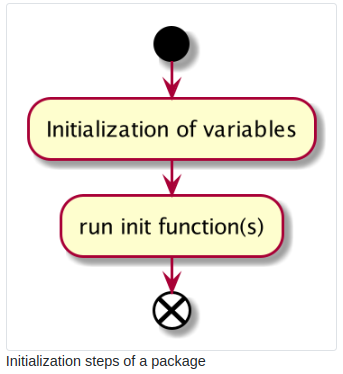
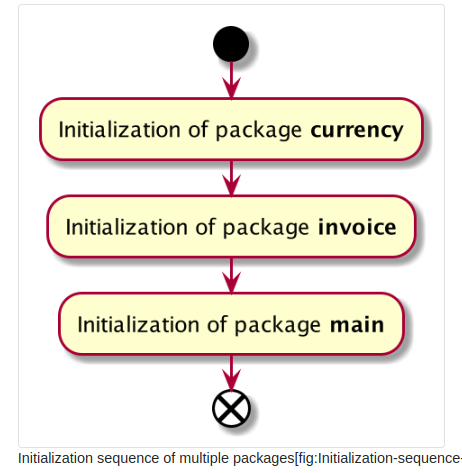
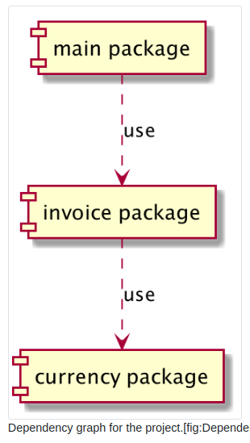
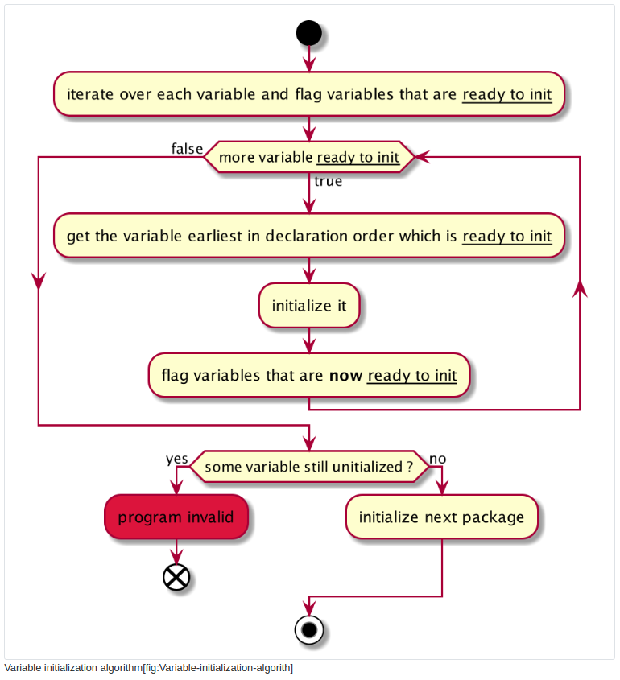

# Package Initialization

## 1. Technical concepts covered

- init function
Package initialization takes place into init functions. In this section, we will see how to use them.

## 2. Example: a MySQL driver

### 2.1. What is MySQL? what is a driver?

MySQL is an open-source database management system.

- A database is “a collection of interrelated data stored together in one or more computerized file”[@institute1990ieee]

    - It is an organized collection of data stored in a computer system.
- SQL is a query language (Structured Query Language) that MySQL understands

- MySQL is an SQL database. It means that it will understand commands written in SQL.

MySQL is a program that you can install on a computer. With MySQL, you create a database, inject and retrieve data. To do those actions, you will need to use a program to issue MySQL commands. Those programs are often called “clients”. Those clients will contact the server. The server is the computer where MySQL has been installed and, therefore, where the data is stored.

- MySQL provides a Command Line Interface (CLI) program.

- MySQL workbench offers a graphical interface (GUI)

- Various programming languages have developed modules/libraries to issue commands to MySQL databases. Sometimes those programs are packaged into extensions that we can install easily.

In the standard library of Go, you can find the package database/sql that provides a generic interface around SQL databases, ie. database systems that can understand SQL.

The standard library does not offer specific programs to speak to a specific database management system. That’s why we need to use a “driver” to speak to MySQL.

A MySQL driver is a module built to interact with a MySQL database. In this section, we will study the open-source driver **github.com/go-sql-driver/mysql.**

### 2.2. Init function from github.com/go-sql-driver/mysql

```go
// https://github.com/go-sql-driver/mysql/blob/master/driver.go
package MySQL

import (
   //...
   "database/sql"
   //...
)
// ...


func init() {
   sql.Register("mysql", &MySQLDriver{})
}
```

The project defines a function named init.

- It has no parameters

- It has no results

- The function calls the exported function Register from the database/sql standard library package

And here is the Register function :

```go
// Register makes a database driver available by the provided name.
// If Register is called twice with the same name or if driver is nil,
// it panics.
func Register(name string, driver driver.Driver) {
   //...
}
```
Thanks to the comment, we understand that this function will make the driver available.

### 2.3. How to use the driver?
Let’s take a look at this example program using the driver.

```go
// package-init/init-mysql/main.go
package main

import (
    "database/sql"
    "log"

    _ "github.com/go-sql-driver/mysql"
)

func main() {
    db, err := sql.Open("mysql", "user:password@/dbname")
    if err != nil {
        panic(err)
    }
    log.Println(db)
    //...
}
```
- In the import block, we have to import statements

    - The first one "database/sql" which imports the standard library package.

    - And _ "github.com/go-sql-driver/mysql" which is a blank import

- Then in the main function, we call the function Open from "database/sql"

    - It will open a connection to the database.

### 2.4. What about the init function

There is no trace of the init function in our main package... It’s therefore perfectly understandable because :

- The init function from the driver is unexported.

- Therefore it’s impossible to call it from another package.

How does Go register the driver if we do not call the init function?

- Our program will call the init function.

- **It’s called because we imported the driver with a blank import statement.**

When you import a package with a blank import statement, the package init function will be run.

Note that the author of the driver package could also remove the init function and specifically, instruct the user to call the Register function manually...

## 3. Initialization rules

The initialization of a package takes place in a specific order defined by the go specification :

1. The imported packages are initialized

    - Variables are initialized

    - Init functions are run

2. Then the package itself is initialized

    - Variables are initialized

    - Init functions are run

Init functions are run sequentially. In other words, init functions are not run concurrently.

## 4. Rules illustration

### 4.1. Tree of the example program

To illustrate those rules, let’s take an example program. In figure 1 you can see the file structure of the program

|----|currency
|----|----currency.go
|----|go.mod
|----|invoice
|----|----invoice.go
|----|main.go
|----|room
|----|----room.go

We have three packages: room, invoice, and currency, along with a main.go file (and a go.mod)

### 4.2. Source code
Here is the go.mod file :

```go
// run go mod init maximilien-andile.com/packageInit/rules
module maximilien-andile.com/packageInit/rules

go 1.13
```

And here is the main file :

```go
// package-init/rules-illustration/main.go
package main

import (
    "fmt"

    "maximilien-andile.com/packageInit/rules/invoice"
)

func init() {
    fmt.Println("main")
}
func main() {
    fmt.Println("--program start--")
    invoice.Print()
}
```

In the main source file, we have added an init function. Inside the main function, we call the invoice package :

```go
// package-init/rules-illustration/invoice/invoice.go
package invoice

import (
    "fmt"

    "maximilien-andile.com/packageInit/rules/currency"
)

func init() {
    fmt.Println("invoice init")
}

func Print() {
    fmt.Println("INVOICE Number X")
    fmt.Println(54, currency.EuroSymbol())
}
```
The package invoice use a function from the currency package. Here is the source of currency package :
```go
// package-init/rules-illustration/currency/currency.go
package currency

import "fmt"

var f = func() string {
    fmt.Println("variable f initialized")
    return "test"
}()

func init() {
    fmt.Println("currency init")
}

func EuroSymbol() string {
    return "EUR"
}
```

The variable f seems a little bit strange. We assign to the variable the output result of an anonymous function (see chapter [chap:Anonymous-Functions-and]). This function returns the string "test". Before returning it displays "variable f initialized".

This function demonstrates when variables are initialized. They call fmt.Println, so we will detect initialization in the program output.

Finally, this is the source file of the room package :

```go
// package-init/rules-illustration/room/room.go
package room

import "fmt"

func init() {
    fmt.Println("room init")
}
```
We can observe that the expected behavior in the output result of our program. First, the imported packages are initialized then the main package is initialized.

### 4.3. Compilation and run

```go
$ go build main.go
./main
variable f initialized
currency init
invoice init
main
--program start--
INVOICE Number X
54 EUR
```

### 4.4. Result analysis



The sequence of a package initialization is always the same :

- Variables are initialized

- Then the init functions are run

What we can note in the log is that packages are initialized in a specific order



This initialization sequence is following the dependencies of our main package. It begins with the package at the end of the dependency graph, which is the package currency



## 5. Order of variables initialization

Let’s see how to determine which variable will be initialized first. Here is a package with three variables and an init function :

The first variable initialized does not depend on anything (except package fmt). It is the first to be initialized. Then the variable b (which depends on variable a) is initialized. When b is initialized, we can initialize c.

Variables are not initialized from top to bottom: here, a is initialized first, but it is put in the second position in the source file.

When the runtime launches the initialization process for a package it will proceed by “cycle”. Each variable has an attribute “ready for initialization”. A variable is considered to be “ready” for initialization when :

1. It is not yet initialized

2. It has no initialization expression OR Its initialization expression has no dependencies on uninitialized variables.

- During the first cycle, the runtime will select: the earliest variable in declaration order AND ready for initialization.

- When the first cycle is completed, the second cycle is launched: Go will select the variable that is earliest in declaration order AND ready for initialization.

- The third cycle will do the same.

- The fourth will also do the same...

- etc...




## 6. Test yourself

1. What is the name of the function that will initialize a package? How many parameters this function have? How many results?
- Here is an example (empty init function) :
```go
func init() {
}
```
- No results, no parameters!
2. Initialization functions are mandatory in each package. True or False?

- False

- Init functions are optional

3. Is it possible to have four initialization functions in a package?

- False.

- Init functions are called after variable initialization.

4. The runtime can run several initialization functions potentially at the same time. True or False?

- False they are run sequentially (one after another)

5. If package A imports package B, which initialization functions are run first ?

- The runtime will run init functions from package B before those of package A

## 7. Key takeaways

- Initialization of packages takes place in init functions.

- init functions are not mandatory.

- A package can declare several init functions.

- init functions are called after variable initialization.

- init functions are run sequentially.