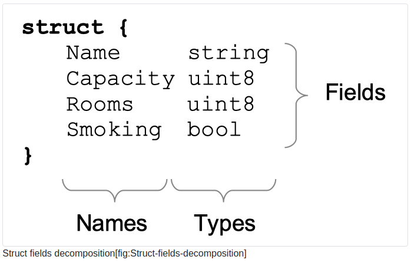
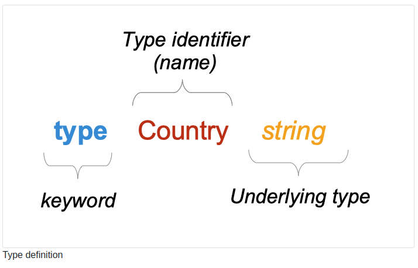

# Types

## 1. What will you learn in this chapter?

- What is a type?

- What are predeclared types?

- What are composite types?

- What is a type literal.

- What is a type struct?

- What are embedded fields?

- How to create a type.

## 2. Technical concepts covered

- Type

- Value set

- Predeclared types

- Type struct

- Composite types

- Fields

- Embedded fields

## 3. What is a type?

“A type determines a set of values together with operations and methods specific to those values.”. Let’s decompose this definition :

- A set of values.…

    - A variable of type uint32 can contain all values from 0 to 4.294.967.295. Those 4+ million values are the set of values allowed by this type.

    - the string “Go is Great” is not an uint32, this value does not belong to the set of values allowed by this type

- with operation and methods specific to those values. Operations and methods are capabilities that are shipped with values of a type.
    - Types have a set of operations and methods that we can apply to values of those types.
    - Go has predeclared types, but you can also create your types. We call those types custom types.
    - You can define methods that are attached to a type.
    - For instance, a Booking type can have a method to compute the total price to pay by the customer.

## 4. Predeclared types
Go has several predeclared types. Those types are part of the Go core; you do not need to declare them to use them. We can classify them into three categories :

- Boolean type

    - bool
- String type

    - string
- numeric types

    - uint, uint8, uint32, uint64

    - int, int8, int32, int64

    - float, float32, float64

    - complex64, complex128

```go
var rooms uint8 = 130
var hotelName string = "New Golang Hotel"
var vacancies bool
```

## 5. Composite type

In the previous section,its we have seen that we can create a variable of a basic type.

You can use those basic types to construct composite types.

-arrays

- pointers

- functions

- slices

- maps channels

- struct

- interfaces

```go
// types/composite/main.go
package main

import "fmt"

func main() {
    // array constructed with the basic type uint8
    var arr [3]uint8

    // pointer constructed with the basic type uint8
    var myPointer *uint8

    // function  constructed with the basic type string
    var nameDisplayer func(name, firstname string) string

    // slices constructed with the basic type uint8
    var roomNumbers []uint8

    // maps constructed with the basic types uint8 and string
    var score map[string]uint8

    // channel constructed with the basic type bool
    var received chan<- bool

    // struct, interface
    // ... see next sections
    fmt.Println(arr, myPointer, nameDisplayer, roomNumbers, score, received)
}
```

*[3]uint8, *uint8, func(name, firstname string) string,...* are called **type literals**. Composite types are constructed with type literals

### 5.1. Struct type

A struct type is a composite type

```go
struct {
    Name     string
    Capacity uint8
    Rooms    uint8
    Smoking  bool
}
```



A struct is composed of fields. Fields can :

1. Explicitly specified: in this case, the field has a name and a type (in the previous examples all fields are explicit

2. Implicitly specified: in this case, we call those fields embedded fields (see next section)

## 6. How to create new types: type definition

### 6.1. New types based on predeclared types

We can declare new types based on existing, predeclared types.

```go
// a new type Firstname
// underlying type : string
type Firstname string

// a new type Currency
// underlying type is string
type Currency string

// a new type VATRate
// underlying type is float64
type VATRate float64
```

Here we create a type from another type. This other type is called the underlying type.

> type Country string

- We create a new type Country

    - The type name is Country (identifier)

    - The underlying type of Country is string.



### 6. 2. New types based on composite types

You can also declare a new type with an underlying composite type.

```go
// new type "ExchangeRate"
// underlying type is map[string]float64
// map[string]float64 is a type litteral
type ExchangeRate map[string]float64


// new type "Birthdate"
// underlying type : time.Time (type Time from the time package)
type Birthdate time.Time


// new type "Hotel"
// underlying type : struct
type Hotel struct {
    Name     string
    Capacity uint8
    Rooms    uint8
    Smoking  bool
}

// new type "Country"
// underlying type : struct
type Country struct {
    Name        string
    CapitalCity string
}
```

## 7. Type struct variable creation

### 7.1. With fields names

```go
france := Country{
    Name:        "France",
    CapitalCity: "Paris",
}

usa := Country{
    Name: "United Sates of America",
}
```

We create two variables of type Country : france and usa.

We can create a new element of type Country, without specifying any fields value :

> empty := Country{}

You can also specify certain fields :

```go
usa := Country{
    Name: "United Sates of America",
}
```
Other fields will be equal to the zero value of the type of the field. Here the value of **CapitalCity** will be equal to the zero value of strings : "".

### 7.2. Without fields names
In the previous example, we write the field name then its value. You can omit the field names :

```go
belgium := Country{
    "Belgium",
    "Bruxelles",
}
```

Here we create a value of type Country and we set the field Name with “Belgium” and the field CapitalCity with “Bruxelles”.

**This syntax has to be used carefully.**


