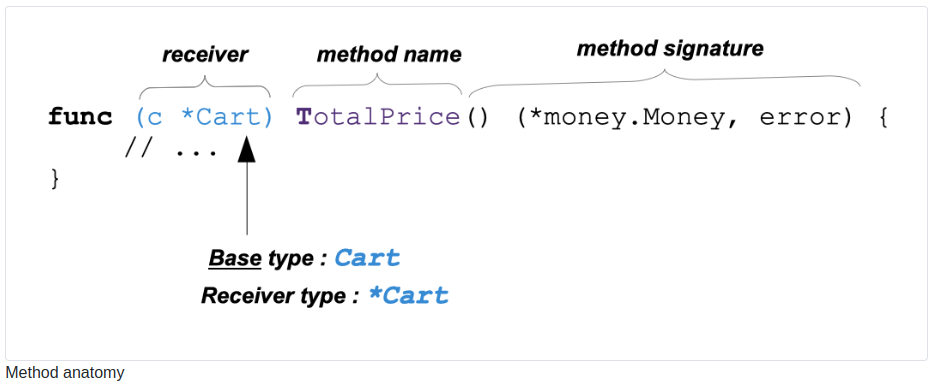
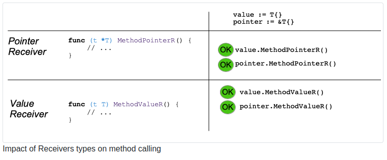
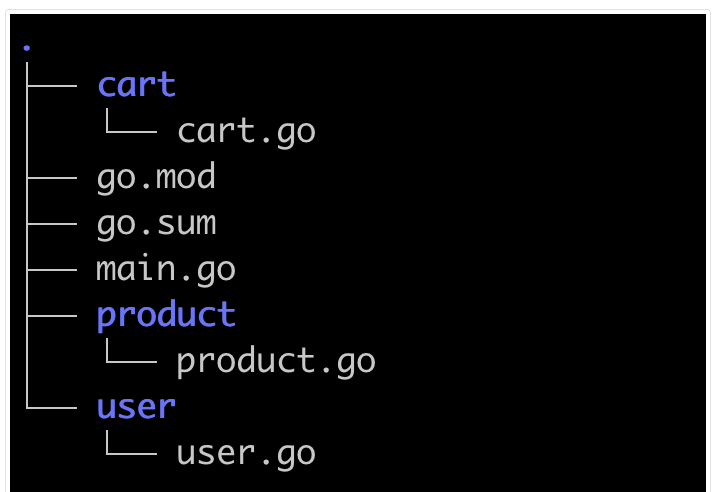

# Methods

## 1. What will you learn in this chapter? 

- What is a method?

- What is a receiver?

- How to create a method.

- How to call a method.

- What is a pointer receiver, a value receiver?

- What is a method set?

- How to name your receivers.

## 2 What is a method?

- A method is a function with a receiver.1.

- The receiver of a method is a special parameter.

- The receiver is not listed in the parameter list but before the method name

- A method can have only one receiver.

- The receiver has a type T or T*

    - When the receiver has a type T, we say that it’s a “value receiver”

    - When it has a type T*, we say that it’s a “pointer receiver”

- We say that the base type is T



```go
// methods/first-example/main.go
package main

import (
    "os/user"
    "time"

    "github.com/Rhymond/go-money"
)

type Item struct {
    ID string
}

type Cart struct {
    ID        string
    CreatedAt time.Time
    UpdatedAt time.Time
    lockedAt  time.Time
    user.User
    Items        []Item
    CurrencyCode string
    isLocked     bool
}

func (c *Cart) TotalPrice() (*money.Money, error) {
    // ...
    return nil, nil
}

func (c *Cart) Lock() error {
    // ...
    return nil
}
```

We have defined the type **Cart**.

This type has two methods: **TotalPrice**

**Lock** Those two methods are functions.

They are bound to the type **Cart**.

The receiver for the method **TotalPrice** is called **c** and is of type ***Cart**

The receiver for the method **Lock** is called **c** and is of type ***Cart**

## 3 Methods are capabilities

With methods, you can give additional capabilities to the cart Type. In the previous example, we add the capability for somebody that manipulate a Cart to :

- Lock the cart

- Compute the total price

## 4 Method Names

- Method names should be unique inside a method set.

- What is a method set?

    - The method set of a type T is the group of all methods with a receiver T

    - The method set of a type *T is the group of all methods with a receiver T and *T

It means that you CANNOT have two methods with the same name, even if the first one has a receiver type and the second one has a value type :

```go
// Forbidden :

func (c *Cart) TotalPrice() (*money.Money, error) {
    //...
}

func (c Cart) TotalPrice() (*money.Money, error) {
    //...
}
```

## 5 How to call methods

Methods are called with the “dot notation”. The receiver argument is passed to the method with a dot.

```go
package main

import (
    "call/cart"
    "log"
)

func main() {
    // load the cart... into variable cart
    newCart := cart.Cart{}

    totalPrice, err := newCart.TotalPrice()
    if err != nil {
        log.Printf("impossible to compute price of the cart: %s", err)
        return
    }
    log.Println("Total Price", totalPrice.Display())

    err = newCart.Lock()
    if err != nil {
        log.Printf("impossible to lock the cart: %s", err)
        return
    }

}

```

- In the previous example, the methods **TotalPrice** and **Lock** are called (with the dot notation)

**totalPrice, err := cart.TotalPrice()**, here we pass the variable **cart** to the method **TotalPrice**

**err = cart.Lock()**, here we pass the variable **cart** to the method **Lock**

Those two methods are bound to the type **Cart** from the current package (main)

We also call the method **Display** bound to the type **Money** from the package **money**

Note that the package cart belongs to the module “call”

## 6 Should I use a pointer receiver or a value receiver? 

When you use a value receiver the data will be copied internally before the method is executed. The method will use a copy of the variable.

This has two consequences :

- A method with a value receiver cannot modify the data passed to it

- The internal copy process might impact your program’s performance (most of the time, it’s negligible, except for heavy type structs).

With a pointer receiver, the data passed to it can be modified by the method.

## 7 Receiver type and method call

The receiver is an additional function parameter.

Methods receivers are either pointer receivers or value receivers.

In this method, the receiver has the type *Cart (a pointer to Cart).

```go
func (c *Cart) TotalPrice() (*money.Money, error) {
    // ...
    return total, nil
}
```

When we call this method, we use the following notation :

```go
newCart := cart.Cart{}
totalPrice, err := newCart.TotalPrice()
//.
```

Did you notice something weird?

- We have learned that a function parameter has a type. This type should be respected (you cannot give a function an uint8 if it expects a string).

- The type of newCart is Cart (from cart package)

- The type of the receiver is *Cart.

- Types are not the same!

Should it trigger an error, no? It does not. Why?

- Go will convert the variable newCart automatically to a pointer.

### 7.1. Rules

- Methods with pointer receivers can take a pointer OR a value as receiver

- Methods with value receivers can take a pointer OR a value as receiver



## 8 Methods visibility

Methods like functions have a visibility.

When the **first letter** of the method name is **capitalized**, the method is **exported**.

In the previous example, we put all our code into the main package; consequently, method visibility did not matter much. However, when you create a package, you must consider methods’ visibility.

- An exported method is callable outside the package.

- A non exported method is NOT callable outside the package.

### 8.1 Example project

Let’s consider a new organization (see figure).

- We have the go.mod, go.sum, and main at the root.go (the application)

- We have three directories; each directory contains source files for a package.

- We have three packages :

    - cart

    - product

    - user

