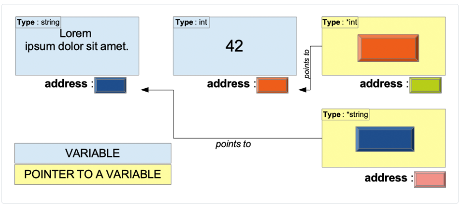
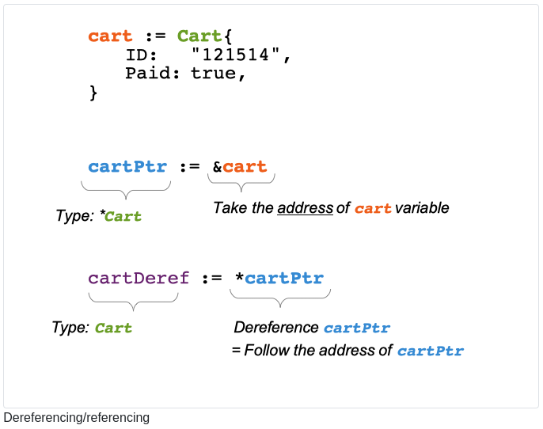
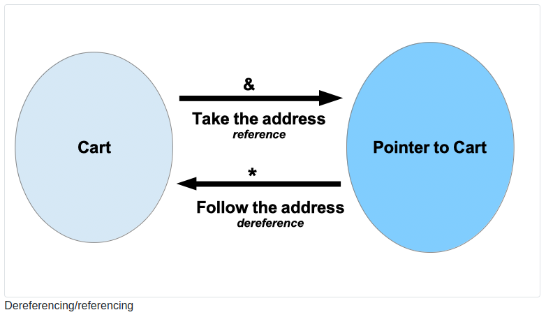

# Pointer type

## 1. What will you learn in this chapter?

- What is a pointer?

- What is a pointer type?

- How to create and use variables of pointer type.

- What is the zero value of a pointer-type variable?

- What is dereferencing?

- What is the specificity of slices, maps, and channels?

## 2 Technical concepts covered

- Pointer

- Memory address

- Pointer type

- Dereferencing

- Referencing

## 3 Pointer là gì? (What is a pointer?)

A pointer is “a data item that specifies the location of another data item”
Con trỏ là “một mục dữ liệu xác định vị trí của một mục dữ liệu khác”

In a program, we are constantly storing and retrieving data. For instance, strings, numbers, complex structs... At the physical level, data are stored at specific addresses in memory. Pointers contain those memory addresses.
Trong một chương trình, chúng ta liên tục lưu trữ và truy xuất dữ liệu. Ví dụ: chuỗi, số, cấu trúc phức tạp... Ở cấp độ vật lý, dữ liệu được lưu trữ tại các địa chỉ cụ thể trong bộ nhớ. Con trỏ chứa các địa chỉ bộ nhớ đó.



Keep in mind that a pointer variable, like any other variable, also has a memory address.
Hãy nhớ rằng biến con trỏ, giống như bất kỳ biến nào khác, cũng có địa chỉ bộ nhớ.

## 4 Pointer types

There isn’t such thing as a unique pointer type. There are as many pointer types as there are types. A pointer type is the set of all pointers to variables of a given type1.
Không có thứ gọi là loại con trỏ duy nhất. Có nhiều loại con trỏ như có nhiều loại. Kiểu con trỏ là tập hợp tất cả các con trỏ tới các biến của một kiểu nhất định.

Pointer types have the following syntax :

> \*BaseType

Where **BaseType** can be any type.

Ex:

> \*int denotes (Biểu thị) all pointers to variables of type int.

> \*uint8 denotes all pointers to variables of type uint8.

```go
type User struct {
    ID string
    Username string
}
```

**\*User** denotes all pointers to variables of type **User**

## 5 How to create a variable of pointer type?

It can be created with the following syntax :

> var p \*int

Here we create a variable p of type *int .*int is a pointer type (which base type is int).

Let’s create an integer variable named **answer**.

> var answer int = 42

Now we can assign a value to the variable **p**:

> p = &answer

With the & symbol we get the address of the variable answer. Let’s print this address!
Với ký hiệu & chúng ta nhận được địa chỉ của biến trả lời. Hãy in địa chỉ này!

> fmt.Println(p)
> // 0xc000012070

**0xc000012070** is a hexadecimal number. You can spot that because it starts with 0x. Memory addresses are often noted in the hexadecimal format. You could still express it with the binary format (with zeros and ones), but it’s not easy to read.

## 6 Zero value of pointer types

The zero value of pointer types is always **nil**. In other words, a pointer that holds no address is equal to **nil**.
Giá trị zero của loại con trỏ luôn bằng nil. Nói cách khác, một con trỏ không chứa địa chỉ thì bằng nil.

## 7 Dereferencing

A pointer variable holds an address to another variable. What if you want to retrieve the value behind the address? You can use the dereference operator `*`.

Một biến con trỏ chứa địa chỉ của một biến khác. Nếu bạn muốn lấy lại giá trị đằng sau địa chỉ thì sao? Bạn có thể sử dụng toán tử quy định `*`.

```go
type Cart struct {
    ID   string
    Paid bool
}
```

Then we create a variable cart of type Cart. We can take the address of this variable, but also follow the address:
Sau đó, chúng ta tạo một biến _cart_ có thể thay đổi kiểu Cart. Chúng ta có thể lấy địa chỉ của biến này nhưng cũng có thể theo địa chỉ:




- With the operator \* you follow the address

- With the operator & you take the address

### 7.1 Warning! Confusion risk.

The dereference operator * is the same symbol as the one used to denote a pointer type. *card may denote a pointer type but also a dereferenced pointer variable. Analyze the usage context closely, and you will easily differentiate the two.

Toán tử * có cùng ký hiệu với ký hiệu được sử dụng để biểu thị loại con trỏ. *card có thể biểu thị một loại con trỏ nhưng cũng có thể biểu thị một biến con trỏ không được tham chiếu. Hãy phân tích bối cảnh sử dụng một cách chặt chẽ và bạn sẽ dễ dàng phân biệt được hai bối cảnh đó.

### 7.2 Nil pointer dereference: runtime panic

There is a panic that every Go programmers have encountered :

Có một nỗi lo lắng mà mọi lập trình viên Go đều từng gặp phải:

```
panic: runtime error: invalid memory address or nil pointer dereference
[signal SIGSEGV: segmentation violation code=0x1 addr=0x0 pc=0x1091507]
```

To better understand it, we will try to reproduce it :

Để hiểu rõ hơn về nó, chúng tôi sẽ cố gắng tái tạo nó:

```
// pointer/nil-pointer-dereference/main.go
package main

import "fmt"

func main() {
    var myPointerVar *int
    fmt.Println(*myPointerVar)
}
```

In this listing, we have defined a pointer variable myPointerVar. This is a variable of type \*int (pointers integers).

Then we are trying to dereference it. myPointerVar variable holds a pointer that has not been initialized therefore the value of this pointer is nil. The program will panic because we are trying to follow a nonexistent address! We are trying to go to the nil address. The nil address is something that does not exist.

Trong danh sách này, chúng ta đã định nghĩa một biến con trỏ myPointerVar. Đây là một biến kiểu \*int (số nguyên con trỏ). Sau đó, chúng tôi đang cố gắng hủy đăng ký nó. Biến myPointerVar chứa một con trỏ chưa được khởi tạo nên giá trị của con trỏ này là nil. Chương trình sẽ panic vì chúng ta đang cố gắng đi theo một địa chỉ không tồn tại! Chúng tôi đang cố gắng đi đến địa chỉ nil. Địa chỉ nil là địa chỉ không tồn tại.

## 8 Maps and channels

Maps and channels are already references to the internal structure. Consequently, a function/method that accepts a map or a channel can modify it, even if the parameter is not a pointer type. Let’s take an example:

Maps và channels đã là tài liệu tham khảo cho internal structure. Do đó, một hàm/phương thức chấp nhận maps hoặc channels có thể sửa đổi nó, ngay cả khi tham số không phải là loại pointer. Hãy lấy một ví dụ:

```go
func addElement(cities map[string]string) {
    cities["France"] = "Paris"
}
```

This function takes a map as input

It adds an entry to the map (key = “France”, value = “Paris”)

```go
package main

import "log"

func main() {
    cities := make(map[string]string)
    addElement(cities)
    log.Println(cities)
}
```

## 9 Slices

### 9.1 Slice definition

A slice is a collection of elements of the same type.

Một slice là một tập hơp các phần tử có cùng kiểu

Internally a slice is a structure that has three fields :

Bên trong slice sẽ gồm 3 phần

- A length

- A capacity

- A pointer to an internal array.

example:

```go
package main

import "log"

func main() {
    EUcountries := []string{"Austria", "Belgium", "Bulgaria"}
    log.Println(EUcountries)
}
```

### 9.2 Function/methods with a slice as parameter/receiver: watch your steps

#### 9.2.0.1 Example 1: adding elements to a slice

```go
// pointer/slices-add-elements/main.go
package main

import "log"

func main() {
    EUcountries := []string{"Austria", "Belgium", "Bulgaria"}
    addCountries(EUcountries)
    log.Println(EUcountries)
}

func addCountries(countries []string) {
    countries = append(countries, []string{"Croatia", "Republic of Cyprus", "Czech Republic", "Denmark", "Estonia", "Finland", "France", "Germany", "Greece", "Hungary", "Ireland", "Italy", "Latvia", "Lithuania", "Luxembourg", "Malta", "Netherlands", "Poland", "Portugal", "Romania", "Slovakia", "Slovenia", "Spain", "Sweden"}...)
}
```

**Question** : In your opinion, what the following program outputs?

```go
[Austria Belgium Bulgaria Croatia Republic of Cyprus Czech Republic Denmark Estonia Finland France Germany Greece Hungary Ireland Italy Latvia Lithuania Luxembourg Malta Netherlands Poland Portugal Romania Slovakia Slovenia Spain Sweden]

[Austria Belgium Bulgaria]
```

#### 9.2.0.2 Explanations

- The function takes an element of type []string as parameter

- When the function is called a copy of the slice EUcountries is done by the language

- The function will get a copy of :

  - the length

  - the capacity and

  - the pointer to the internal array.

- Inside the function, the countries are effectively added

- The length of the slice will grow,

- The runtime will allocate a new internal array.

This change will ONLY affect the copied version

#### 9.2.0.3 Example 2: update elements

```go
// pointer/slices-update-elements/main.go
package main

import (
    "log"
    "strings"
)

func main() {
    EUcountries := []string{"Austria", "Belgium", "Bulgaria"}
    upper(EUcountries)
    log.Println(EUcountries)
}

func upper(countries []string) {
    for k, _ := range countries {
        countries[k] = strings.ToUpper(countries[k])
    }
}
```

**Question** : In your opinion, what the following program outputs?

#### 9.2.0.4 Explanations

- The function upper gets a copy of the slice EUcountries (like before)

Inside the function, we change the values of the slice elements countries[k] = strings.ToUpper- (countries[k])

- The slice copy has still a reference to the underlying array

- We can modify it!

- ... but only the elements of the slice that are already in the slice.

#### 9.2.0.5 Conclusion

- When you pass a slice to a function, it gets a copy of the slice.

- It does not mean that you cannot modify the slice.

- You can just modify the elements already present in the slice.

### 9.3 Function/methods with a pointer to a slice as parameter/receiver

With a pointer, you can modify the slice as expected :

```go
package main

import (
    "log"
)

func main() {
    EUcountries := []string{"Austria", "Belgium", "Bulgaria"}
    addCountries2(&EUcountries)
    log.Println(EUcountries)
}

func addCountriesWithPointer(countriesPtr *[]string) {
    *countriesPtr = append(*countriesPtr, []string{"Croatia", "Republic of Cyprus", "Czech Republic", "Denmark", "Estonia", "Finland", "France", "Germany", "Greece", "Hungary", "Ireland", "Italy", "Latvia", "Lithuania", "Luxembourg", "Malta", "Netherlands", "Poland", "Portugal", "Romania", "Slovakia", "Slovenia", "Spain", "Sweden"}...)
}
```

- The function **addCountriesWithPointer** takes a pointer to a slice of strings (\*[]string) as parameter

- The function **append** is called with as first parameter \*countriesPtr (we dereference the pointer countriesPtr)

- The second parameter of append doesn’t change

- The result is then affected to \*countriesPtr

## 10 Pointers to structs

There is a shortcut that allows you to directly modify a variable of type struct without the dereferencing operator:

Có một lối tắt cho phép bạn sửa đổi trực tiếp một biến kiểu struct mà không cần toán tử dereferencing:

```go
cart := Cart{
    ID:          "115552221",
    CreatedDate: time.Now(),
}
cartPtr := &cart
cartPtr.Items = []Item{
    {SKU: "154550", Quantity: 12},
    {SKU: "DTY8755", Quantity: 1},
}
log.Println(cart.Items)
// [{154550 12} {DTY8755 1}]
```

- cart is a variable of type Cart

car là một biến có kiểu của struct Cart

- cartPtr := &cart : takes the address of the variable cart and stores it into cartPtr.

cartPtr là một biến sẽ lấy địa chỉ nhớ của biến cart và lưu nó vào biến cartPtr

- With the variable cartPtr we can directly modify the field Items of the variable cart

Với biến cartPtr chúng ta có thể sửa đổi trực tiếp các field Items trong biến cart, hoặc cũng có thể là gán mới

- There is an “automatic dereference” which is easier to write than the equivalent

cartPtr.Items = [...]: Bạn gán giá trị cho trường Items thông qua cartPtr. Go tự động thực hiện việc giải tham chiếu(automatic dereference) ở đây, nên bạn không cần phải sử dụng cú pháp dereference (như (\*cartPtr).Items) để truy cập trường Items. Nếu không có auto dereference thì bạn sẽ phải code như sau để có thể gán Items vào cartPtr:

```go
(*cartPtr).Items = []Item{
    {SKU: "154550", Quantity: 12},
    {SKU: "DTY8755", Quantity: 1},
}
```

## 11 Methods with pointer receivers

Pointers are often used as receivers of methods. Let’s take an example with a Cat type:

Con trỏ thường được sử dụng làm receivers của methods. Ví dụ:

```go
type Cat struct {
  Color string
  Age uint8
  Name string
}
```

You can define a method for this type with a pointer to a Cat as receiver (\*Cat):

Bạn có thể định nghĩa 1 method với loại này bằng một pointer trỏ đến _Cat_ như là một receiver(\*Cat):

```go
func (cat *Cat) Meow(){
  fmt.Println("Meooooow")
}
```

Ex other:

```go
func (cat *Cat) Rename(newName string){
  cat.Name = newName
}
```

This method will change the name of the cat. Therefore, the pointer is useful because we modify one of the Cat struct fields.

Of course, if you do not want to use a pointer receiver, you can :

method này sẽ thay đổi name của cat. Có thể thấy pointer rất hữu ích vì chúng cho phép chúng ta sửa đổi một field trong struct.

Nếu bạn không muốn sử dụng pointer receiver thì bạn có thể sử dụng value receiver:

```go
func (cat Cat) Rename(newName string){
  cat.Name = newName
}
```

```go
// pointer/methods-pointer-receivers/main.go
package main

import "fmt"

type Cat struct {
    Color string
    Age   uint8
    Name  string
}

func (cat *Cat) Meow() {
    fmt.Println("Meooooow")
}

func (cat *Cat) Rename(newName string) {
    cat.Name = newName
}

func (cat Cat) RenameV2(newName string) {
    cat.Name = newName
    fmt.Println("Inside RenameV2:", cat.Name)
	fmt.Println(cat.Name)
}

func main() {
    cat := Cat{Color: "blue", Age: 8, Name: "Milow"}
    cat.Rename("Bob")
    fmt.Println(cat.Name)
    // Bob

    cat.RenameV2("Ben")
    fmt.Println(cat.Name)
    // Bob
}
```

### 11.0.0.1 When to use a pointer receiver, when to use a value receiver

- Use a pointer receiver when :

  - Your struct is heavy (otherwise, Go will make a copy of it)
    Nếu struct của bạn lớn

  - You want to modify the receiver (for instance, you want to change the name field of a struct variable)
    Bạn muốn thay đổi giá trị của receiver

  - Your struct contains a synchronization primitive (like sync.Mutex) field. If you use a value receiver, it will also copy the mutex, making it useless and leading to synchronization errors.
    Nếu trong struct của bạn chứa một synchronization primitive(Như sync.Mutex). Nếu bạn sử dụng value receiver thì nó cũng sẽ copy mutex và làm cho field trở nên vô dụng và dẫn đến lỗi đồng bộ

- Use a value receiver

  - When your struct is small
    Khi struct của bạn nhỏ

  - When you do not intend to modify the receiver
    Khi bạn không có ý định sửa đổi receiver

  - When the receiver is a map, a func, a chan, a slice, a string, or an interface value (because internally it’s already a pointer)
    Khi receiver là một map, channel, slice, string hoặc một interface value(Vì trong nó đã là một pointer rồi)

  - When your other receivers are pointers
    Khi những receiver khác là một pointer

## 12 Test yourself

### 12.1 Questions

How to denote the type of a variable holding a pointer to a Product?

What is the zero value of a pointer type?

What does “dereferencing” mean?

How to dereference a pointer?

Fill in the blanks. A \_**\_ is internally a pointer to an \_\_**.

True or false. When I want to modify a map in a function, my function needs to accept a pointer to the map as parameter. I also need to return the modified map.

### 12.2 Answers

1. How to denote the type of a variable holding a pointer to a Product ?

   \*Product

2. What is the zero value of a pointer type?

   nil

3. What does “dereferencing” mean?

   A pointer is an address to a memory location where data is stored.

   When we dereference a pointer, we can access the data stored in memory at this address.

4. How to dereference a pointer?

   By using the dereference operator \*

5. Fill in the blanks. A \_**\_ is internally a pointer to an \_\_**.

   A slice is internally a pointer to an array

6. True or false. When I want to modify a map in a function, my function needs to accept a pointer to the map as parameter. I also need to return the modified map.

   False.

7. You can just accept a map (not a pointer to a map)

   No need also to return the modified map.

## 13 Key takeaways

- Pointers are addresses to data

- The type \*T denotes the set of all pointers to variables of the type T.

- To create a pointer variable, you can use the operator &. It will take the address of a variable

```go
userId := 12546584
p := &userId

username is a variable of type int

p is a variable of type *int
*int denotes all the pointers to variables of type int
```

- A function with a parameter/receiver of pointer type can modify the value that the pointer points to.

- Maps and channels are “reference types”
- Functions/Methods that accept maps or channels can modify the values stored internally in those two data structures (no need to pass a pointer to a map or a pointer to a channel)

  Reference types (kiểu tham chiếu) là các kiểu dữ liệu mà giá trị của chúng không trực tiếp chứa dữ liệu thực, mà thay vào đó chứa địa chỉ bộ nhớ nơi dữ liệu thực được lưu trữ. Khi bạn gán một map hoặc channel cho một biến khác, cả hai biến đều trỏ tới cùng một dữ liệu trong bộ nhớ.

  Điều này có nghĩa là nếu bạn thay đổi dữ liệu thông qua một trong hai biến, dữ liệu thực sự sẽ bị thay đổi, và các biến khác trỏ tới nó cũng sẽ thấy sự thay đổi này.

  ```go
  func main() {
  m1 := map[string]int{"a": 1, "b": 2}
  m2 := m1 // m2 trỏ tới cùng dữ liệu với m1

  m2["a"] = 100 // Thay đổi dữ liệu qua m2

  fmt.Println(m1["a"]) // In ra 100, vì m1 và m2 cùng trỏ tới một map
  }
  ```

- Functions/Methods that accept maps or channels can modify the values stored internally in those two data structures (no need to pass a pointer to a map or a pointer to a channel)
  Function/method nếu chấp nhận một map hoặc chanel thì đều có thể sửa đổi giá trị đã lưu trữ bên trong 2 data structure này(không vần truyền pointer vào map hoặc channel)

- A slice holds a reference to an array internally; any function/method that accepts a slice can modify the slice elements.

- When you want to modify a slice length and capacity in a function, you should pass to that function a pointer to a slice (\*[]string)
  Nếu bạn muốn sửa đổi độ dài và dung lượng của slice trong function, bạn có thể truyền vào function đó một pointer tới slice đó. Khi bạn truyền một slice vào một hàm mà không sử dụng con trỏ, bạn thực sự đang truyền một bản sao của cấu trúc này. Điều này có nghĩa là nếu bạn thay đổi length hoặc capacity của slice bên trong hàm, những thay đổi này sẽ chỉ áp dụng cho bản sao, và không ảnh hưởng đến slice gốc.

```go
func modifySlice(slicePtr *[]string) {
    *slicePtr = append(*slicePtr, "new element")
}

func main() {
    s := []string{"a", "b", "c"}
    modifySlice(&s)
    fmt.Println(s) // [a b c new element]
}
```

Dereferencing allow you to access and modify the value stored at the pointer address.
Giải tham chiếu (Dereferencing) cho phép bạn truy cập và sửa đổi giá trị được lưu trữ trong địa chỉ nhớ của pointer

To dereference a pointer, use the operator \*

```go
userId := 12546584
p := &userId
*p = 4
log.Println(userId)

p is a pointer.

With *p we dereference the pointer p

We modify the value of userId with the instruction *p = 4

At the end of the code snippet, the value of userId is 4 (and no longer 12546584)

khi làm việc với các trường hoặc phương thức của struct trong Go, ngôn ngữ này thường thực hiện việc giải tham chiếu tự động. Điều này có nghĩa là bạn không luôn phải sử dụng * để truy cập hoặc thay đổi giá trị mà một con trỏ trỏ tới. Go sẽ làm điều này cho bạn khi ngữ cảnh đã rõ ràng.
```

When you have a pointer to a struct, you can access a field directly with your pointer variable (without using the dereference operator)

Khi bạn có một pointer trỏ tới struct. bạn có thể truy cập trực tiếp vào bằng biến con trỏ của mình

Example :

```go
type Cart struct {
    ID string
}
var cart Cart
cartPtr := &cart
Instead of writing : (*cartPtr).ID = "1234"

You can directly write : cartPtr.Items = "1234"

The cart variable is effectively modified

```
