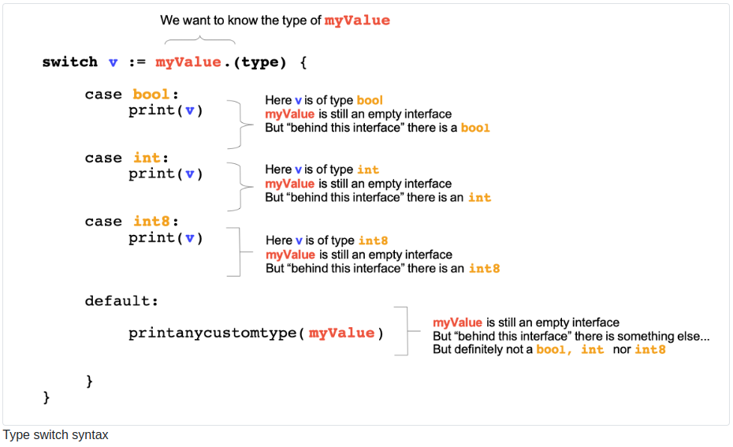

# Chapter 16: Interfaces

## 1 What will you learn in this chapter?

- What is a type interface?

- How to define an interface.

- What “implement an interface” means.

- The advantages of interfaces

## 2 Technical concepts covered

- Interface

- Concrete implementation

- To implement an interface

- The method set of an interface.

## 3 Introduction

Interfaces seem difficult to understand when you just start programming. Often new programmers do not fully understand the potential of interfaces. This section aims to explain what an interface is, why it is interesting, and how to create interfaces.

## 4 A basic definition of an interface

An interface is a contract that defines a set of behaviors.
interface là một contract xác định một tập hợp các hành vi.

Interfaces are a pure object of design they just define a set of behaviors (ie. Methods) without giving any implementation of those behaviors.

interface là một đối tượng thiết kế thuần túy. Chúng xác định một tập hợp các hành vi(Method) mà không có bất kì implement nào cho hành vi đó

An interface is a kind of type that defines a set of methods without implementing them

Một interface là một loại kiểu xác định một tập hợp các method mà không có bất kì implement nào

```go
type Reader interface {
    Read(p []byte) (n int, err error)
}
```

Here we have an interface type named Reader. It specifies one method named Read. The method has no body, no implementation. The only thing specified is the method name and its signature (parameters and results).

### 4.1 Zero value of an interface type

The zero value of the interface type is **nil**. Example:

```go
var r io.Reader
log.Println(r)
// <nil>
```

## 5 Basic Example

```go
type Human struct {
    Firstname string
    Lastname string
    Age int
    Country string
}

type DomesticAnimal interface {
    ReceiveAffection(from Human)
    GiveAffection(to Human)
}
```

- First, we declare a type named Human
  Khai báo một struct **Human**

- The we declare a new type interface named DomesticAnimal two methods : ReceiveAffection and GiveAffection.
  Khai báo một một interface với tên là **DomesticAnimal** với 2 method là **ReceiveAffection**, **GiveAffection**

- It signals to the developer that to be a DomesticAnimal we need to have at least two behaviors: ReceiveAffection and GiveAffection
  Nó báo hiệu cho nhà phát triển rằng để trở thành DomesticAnimal, chúng ta cần có ít nhất hai hành vi: ReceiveAffection và GiveAffection

Let’s create two types :

```go
type Cat struct {
    Name string
}

type Dog struct {
    Name string
}
```

We have two new types. To make them respect the contract of our interface DomesticAnimal, we have to define for each type the methods dictated by the interface.

Chúng tôi có hai types mới. Để khiến họ respect contract của interfacen DomesticAnimal của chúng tôi, chúng tôi phải define cho từng type các method do interface quy định.

Let’s begin with the Cat type:

```go
func (c Cat) ReceiveAffection(from Human) {
    fmt.Printf("The cat named %s has received affection from Human named %s\n", c.Name, from.Firstname)
}

func (c Cat) GiveAffection(to Human) {
    fmt.Printf("The cat named %s has given affection to Human named %s\n", c.Name, to.Firstname)
}
```

Now the type Cat implements the DomesticAnimal interface. We do the same now for the Dog type :

Bây giờ có thể thấy là type **Cat** đã implement interface **DomesticAnimal**

```go
func (d Dog) ReceiveAffection(from Human) {
    fmt.Printf("The dog named %s has received affection from Human named %s\n", d.Name, from.Firstname)
}

func (d Dog) GiveAffection(to Human) {
    fmt.Printf("The dog named %s has given affection to Human named %s\n", d.Name, to.Firstname)
}
```

```go
func Pet(animal DomesticAnimal, human Human) {
    animal.GiveAffection(human)
    animal.ReceiveAffection(human)
}
```

This function can take any type that implements the type interface DomesticAnimal as parameter. Therefore we do not have to create specific functions for cats, dogs, snakes, .… This function is generic and can be executed for different types :

Hàm này có thể lấy bất kỳ loại nào implement type interface DomesticAnimal làm tham số. Do đó, chúng ta không phải tạo các hàm cụ thể cho cats, dogs, rắn, rats.… Hàm này là một generic và có thể được thực thi cho các loại khác nhau

The Pet function takes a DomesticAnimal type interface as a first parameter and an Human as a second parameter.

Inside the function, we call the two functions of the interface.

```go
// interfaces/first-example/main.go
//...

func main() {

    // Create the Human
    var john Human
    john.Firstname = "John"


    // Create a Cat
    var c Cat
    c.Name = "Maru"

    // then a dog
    var d Dog
    d.Name = "Medor"

    Pet(c, john)
    Pet(d,john)
}
```

## 6 The compiler is watching you!

```go
// ...
// let's create a concrete type Snake
type Snake struct {
    Name string
}
// we do not implement the methods ReceiveAffection and GiveAffection intentionally
//...


func main(){

    var snake Snake
    snake.Name = "Joe"

    Pet(snake, john)
}
```

We create a new type Snake

This type does not implement any methods of the DomesticAnimal animal

In the main function, we create a new variable of type Snake

We then call the Pet function with this variable as first parameter.

It does not compile :

```go
./main.go:70:5: cannot use snake (type Snake) as type DomesticAnimal in argument to Pet:
    Snake does not implement DomesticAnimal (missing GiveAffection method)
```

The compiler stops at the first method in alphabetical order that is not implemented.

## 10 Implicit implementation

Interfaces are implicitly implemented. When you declare a type you do not have to specify which interfaces it implements.

Các Interfaces được thực hiện ngầm. Khi bạn khai báo một type, bạn không cần phải chỉ định nó sẽ triển khai Interfaces nào.

## 11 PHP and JAVA

In other languages, you have to specify the interface implementations.

- Java :

```java
// JAVA
public class Cat implements DomesticAnimal{
    public void receiveAffection(){
        //...
    }
    public void giveAffection(){
        //..
    }
}
```

- PHP:

```php
//PHP
<?php

class Cat implements DomesticAnimal {
    public function receiveAffection():void {
        // ...
    }
    public function giveAffection():void {
        // ...
    }
}
?>
```

In those two languages, we have classes. You can see that you have to add the term “implements” when you declare a class that implements an interface.

Trong các ngôn ngữ khác, bạn sẽ có các class. Bạn có thể nhìn thấy thuật ngữ Implement khi bạn khai báo một class sẽ implement interface nào.

You might ask how the Go runtime handles those implicit interface implementations. We will try to draw an explanation of the mechanism of interface values.

Bạn có thể hỏi cách thời gian chạy Go xử lý các triển khai giao diện tiềm ẩn đó như thế nào. Chúng tôi sẽ cố gắng giải thích cơ chế của các giá trị giao diện.

## 12 The empty interface

Go’s empty interface is the simplest and smaller interface you can write. Its method set is composed of exactly 0 methods.

interface empty của Go là interface đơn giản và nhỏ gọn nhất mà bạn có thể viết. Tập phương thức của nó bao gồm chính xác 0 methods.

> interface {}

That being said, every type implement the empty interface. You might ask why such a boring interface is interesting. By definition, an empty interface value can hold values of any type. It’s useful if you want to build a method that accepts any type.

Điều đó đang được nói, mọi type đều triển khai empty interface. Bạn có thể hỏi tại sao một interface nhàm chán như vậy lại thú vị. Theo định nghĩa, một value interface empty có thể chứa bất kỳ giá trị nào. Sẽ rất hữu ích nếu bạn muốn xây dựng một method chấp nhận bất kì type nào.

Let’s take some examples from the standard library.

- In the log package you have a Fatal method that takes as input variables of any type :

> func (l \*Logger) Fatal(v ...interface{}) { }

- In the fmt package, we also have many methods that take as input an empty interface. For instance the Printf function

> func Printf(format string, a ...interface{}) (n int, err error) { }

### 12.1 Type switch

A function that accepts an empty interface as a parameter generally needs to know its input parameter’s effective type.

Một hàm chấp nhận empty interface làm tham số thường cần biết type input paramete

To do so, the function can use a “type switch”, this is a switch case that will compare a type instead of a value.

Để làm như vậy, hàm có thể sử dụng “type switch”, đây là trường hợp chuyển đổi sẽ so sánh một type thay vì một value.

Here is an example taken from the standard library (file runtime/error.go, package runtime):

```go
// printany prints an argument passed to panic.
// If panic is called with a value that has a String or Error method,
// it has already been converted into a string by preprintpanics.
func printany(i interface{}) {
    switch v := i.(type) {
    case nil:
        print("nil")
    case bool:
        print(v)
    case int:
        print(v)
    case int8:
        print(v)
    case int16:
        print(v)
    case int32:
        print(v)
    case int64:
        print(v)
    case uint:
        print(v)
    case uint8:
        print(v)
    case uint16:
        print(v)
    case uint32:
        print(v)
    case uint64:
        print(v)
    case uintptr:
        print(v)
    case float32:
        print(v)
    case float64:
        print(v)
    case complex64:
        print(v)
    case complex128:
        print(v)
    case string:
        print(v)
    default:
        printanycustomtype(i)
    }
}
```



### 12.2 About the usage of the empty interface

- You should use the empty interface very carefully.

  Bạn nên sử dụng giao diện trống thật cẩn thận.

- Use the empty interface when you have no other choices.

  Sử dụng empty interface khi bạn không có lựa chọn nào khác.

- The empty interface gives no information to the person who will use your functions or methods, hence they will have to refer to the documentation, which can be frustrating.

  empty interface không cung cấp thông tin cho người sẽ sử dụng các hàm hoặc phương thức của bạn, do đó họ sẽ phải tham khảo tài liệu, điều này có thể gây khó chịu.

- If you accept an empty interface, your function/method will have to check the input type, making the code more complex.

  Nếu bạn chấp nhận một giao diện trống, hàm/phương thức của bạn sẽ phải kiểm tra loại đầu vào, làm cho mã trở nên phức tạp hơn.

```go
func (c Cart) ApplyCoupon(coupon Coupon) error  {
    //...
}

func (c Cart) ApplyCoupon2(coupon interface{}) (interface{},interface{}) {
    //...
}
```

The method `ApplyCoupon` strictly specify the type that it will accept and return. Whereas `ApplyCoupon2` does not specify its types in input and output. As a caller, it is more difficult to use `ApplyCoupon2` compared to `ApplyCoupon`.

Phương thức ApplyCoupon chỉ định rõ loại mà nó sẽ chấp nhận và trả về. Trong khi ApplyCoupon2 không chỉ định loại của nó trong đầu vào và đầu ra. Với tư cách là người gọi, việc sử dụng ApplyCoupon2 khó hơn so với ApplyCoupon.

## 13 Application: Cart storage

13.1 Specification
You build an e-commerce website; you have to store and retrieve customer carts. The three following behaviors have to be developed:

- Get a cart by its ID

- Put a cart in the database

Propose an interface for those two behaviors.

Create also a type that implements those two interfaces. (Do not implement the logic in the method.)

### 13.2 Solution

Here is a proposed interface :

```go
// interfaces/application/main.go

type CartStore interface {
    GetById(ID string) (*cart.Cart, error)
    Put(cart *cart.Cart) (*cart.Cart, error)
}
```

A type that implements the interface :

```go
type CartStoreMySQL struct{}

func (c *CartStoreMySQL) GetById(ID string) (*cart.Cart, error) {
    // implement me
}

func (c *CartStoreMySQL) Put(cart *cart.Cart) (*cart.Cart, error) {
    // implement me
}
```

another

```go
type CartStorePostgres struct{}

func (c *CartStorePostgres) GetById(ID string) (*cart.Cart, error) {
    // implement me
}

func (c *CartStorePostgres) Put(cart *cart.Cart) (*cart.Cart, error) {
    // implement me
}
```

## 14 Why should you use interfaces?

### 14.1 Evolutivity

When you use interfaces as input in your methods or functions, you design your program to be evolutive. Future developers (or a future you) can create new implementations without changing large portions of code.

Khi bạn sử dụng giao diện làm đầu vào trong các phương thức hoặc hàm của mình, bạn thiết kế chương trình của mình theo hướng phát triển. Các nhà phát triển trong tương lai (hoặc bạn trong tương lai) có thể tạo các triển khai mới mà không cần thay đổi nhiều phần mã.

Imagine that you built an application that performs database reads, insert, and updates. You can use two design approaches:

Hãy tưởng tượng rằng bạn đã xây dựng một ứng dụng thực hiện việc đọc, chèn và cập nhật cơ sở dữ liệu. Bạn có thể sử dụng hai phương pháp thiết kế:

1. Create a type and methods that are closely linked to the database engine you are using now.

   Tạo một loại và các phương thức được liên kết chặt chẽ với công cụ cơ sở dữ liệu mà bạn đang sử dụng.

2. Create an interface that lists all the operations and a concrete implementation for your database engine.

   Tạo một giao diện liệt kê tất cả các hoạt động và triển khai cụ thể cho công cụ cơ sở dữ liệu của bạn.

   In the first approach, you create methods that will take as parameter a specific implementation.

   Trong cách tiếp cận đầu tiên, bạn tạo các phương thức sẽ lấy tham số của một triển khai cụ thể.

   By doing so, you lock the program to one implementation

   Bằng cách đó, bạn khóa chương trình vào một lần triển khai

   In the second approach, you create methods that accept an interface.

   Trong cách tiếp cận thứ hai, bạn tạo các phương thức chấp nhận giao diện.

   Changing the implementation is as easy as creating a new type that implements the interface

   Thay đổi cách triển khai cũng dễ dàng như tạo một kiểu mới triển khai giao diện

## 17 Key takeaways

- An interface is a contract

- It specifies methods (behaviors) without implementing them.

```go
type Cart interface {
    GetById(ID string) (*cart.Cart, error)
    Put(cart *cart.Cart) (*cart.Cart, error)
}
```

- An interface is a type (like structs, arrays, maps, ...)
- We call the methods specified in an interface the method set of the interface

  Chúng tôi gọi các phương thức được chỉ định trong một giao diện là tập hợp phương thức của giao diện

- A type can implement multiple interfaces.
- There is no need to explicit that a type implements an interface
  Không cần phải nói rõ rằng một loại thực hiện một giao diện(Ngược lại với các ngôn ngữ khác yêu cầu khai báo nó (PHP, Java, ...))
- An interface might be embedded into another interface; in that case, the embedded interface methods are added to the interface.
  Một giao diện có thể được nhúng vào một giao diện khác; trong trường hợp đó, các phương thức giao diện nhúng sẽ được thêm vào giao diện.

- Interface types can be used like any other type
  Các types Interface có thể được sử dụng như bất kỳ loại nào khác

- The zero value of the interface type is nil.
  Giá trị 0 của type interface là `nil`

- Any type implement the empty interface interface{}
  Bất kỳ type nào đều triển khai interface empty `interface{}`

- The empty interface specifies 0 methods
  interface empty chỉ định 0 phương thức

- To get the concrete type of an empty interface, you can use a type switch :
  Để có được loại cụ thể của interface empty, bạn có thể sử dụng type switch :

```go
switch v := i.(type) {
    case nil:
        print("nil")
    case bool:
        print(v)
    case int:
        print(v)
}
```

When we can implement a behavior in various ways, we can probably create an interface.

Khi chúng ta có thể thực hiện một hành vi theo nhiều cách khác nhau, chúng ta có thể tạo ra một giao diện.

Ex: Storage (we can use a MySQL, Postgres, DynamoDB, Redis database to store the same data)

Ví dụ: Storage (chúng ta có thể sử dụng cơ sở dữ liệu MySQL, Postgres, DynamoDB, Redis để lưu trữ cùng một dữ liệu)
