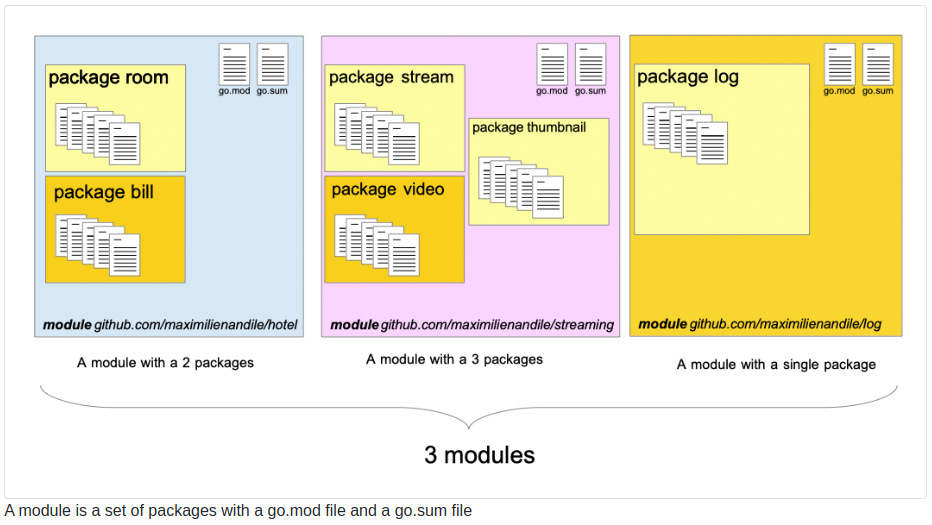

# Chapter 17: Go modules

## 1 What will you learn in this chapter?

1. What is a Go module?

Go module là một cách quản lý các gói (package) trong Go, cho phép bạn tạo các dự án Go, quản lý các phiên bản của các thư viện (dependencies) mà dự án của bạn sử dụng.

2. What are a dependency and a dependency graph?

- dependency và dependency graph là gì ?.

  Dependency (phụ thuộc) là các thư viện hoặc mã nguồn mà dự án của bạn dựa vào để hoạt động.
  Dependency graph (đồ thị phụ thuộc) là một sơ đồ thể hiện các mối quan hệ giữa các thư viện phụ thuộc, giúp bạn biết thư viện nào phụ thuộc vào thư viện nào.

3. The Go approach to version selection.

- Cách tiếp cận của Go đối với việc chọn phiên bản.

  Go sử dụng cơ chế chọn phiên bản dựa trên phiên bản tối thiểu cần thiết. Nó giúp tự động tìm và chọn phiên bản phù hợp nhất cho các thư viện phụ thuộc của bạn mà không gây xung đột.

4. How to use Semantic Versioning.

- Cách sử dụng Semantic Versioning.

  Semantic Versioning (phiên bản ngữ nghĩa) là một tiêu chuẩn để đặt số phiên bản cho các thư viện, theo định dạng: MAJOR.MINOR.PATCH. Trong đó, MAJOR là thay đổi lớn (có thể phá vỡ tương thích), MINOR là các tính năng mới (không phá vỡ tương thích), và PATCH là các sửa lỗi.

- How to perform basic go Modules operations

  Cách thực hiện các thao tác cơ bản với Go Modules.

- upgrade all, upgrade one, downgrade one.

## 2 Introduction

Modules have been introduced with version 1.11 of Go. Gophers can split their developments into separate code units that can be reused across other projects.

Các mô-đun đã được giới thiệu với phiên bản 1.11 của Go. Gophers có thể chia sự phát triển của họ thành các đơn vị mã riêng biệt để có thể sử dụng lại cho các dự án khác.

## 3 Dependency

Developers reuse code that their peers developed to:

Các nhà phát triển sử dụng lại mã mà các đồng nghiệp của họ đã phát triển để:

- Reduce the development time

  Giảm thời gian phát triển

  - Somebody might have already developed some basic functionalities team. Why taking time to develop it yourself?

  Ai đó có thể đã phát triển một số nhóm chức năng cơ bản. Tại sao phải dành thời gian để tự phát triển nó?

  - What is your added value?

  Giá trị gia tăng của bạn là gì?

- Reduce the maintenance cost.

  Giảm chi phí bảo trì.

  - The code that your team write needs to be maintained (ie. solving bugs, fixing vulnerabilities ...)

    Mã mà nhóm của bạn viết cần được duy trì (ví dụ: giải quyết lỗi, sửa lỗ hổng ...)

    The code written by a dynamic community might be efficiently maintained.

    Mã được viết bởi một cộng đồng năng động có thể được duy trì một cách hiệu quả.

## 4 Definition of a Go module

A module is a group of packages (or a single package) that are (is) versioned. This group of go files forms together a module. Modules can be dependant on other modules.

Mô-đun là một nhóm các gói (hoặc một gói duy nhất) đã được phiên bản. Nhóm tập tin go này tạo thành một mô-đun. Các mô-đun có thể phụ thuộc vào các mô-đun khác.

- A module is identified by a string which is called the “module path”.

  Một mô-đun được xác định bằng một chuỗi được gọi là “đường dẫn mô-đun”.

- The requirements (if any) of the module are listed in a specific file.

  Các yêu cầu (nếu có) của module được liệt kê trong một file cụ thể.

- Go will use this file for each installation to build the module.

  Go sẽ sử dụng tệp này cho mỗi lần cài đặt để xây dựng mô-đun.

- The file is named go.mod.

  Tệp có tên go.mod.

- Go will also generate a file named go.sum. We will see later what it is.

  Go cũng sẽ tạo một tệp có tên go.sum. Sau này chúng ta sẽ xem nó là gì.



## 5 The go.mod file

The go.mod file has the following structure

```go
module gitlab.com/maximilienandile/myAwesomeModule

go 1.15

require (
    github.com/PuerkitoBio/goquery v1.6.1
    github.com/aws/aws-sdk-go v1.36.31
)
```

- The first line gives the module path (it can be either a local path or a URI to a repository hosted on a version control system).

  Dòng đầu tiên cung cấp đường dẫn mô-đun (nó có thể là đường dẫn cục bộ hoặc URI tới kho lưu trữ được lưu trữ trên hệ thống kiểm soát phiên bản).

- module is a reserved keyword. In the example, the module is hosted on gitlab.com on my account. The project is named myAwesomeModule.

  mô-đun là một từ khóa dành riêng. Trong ví dụ này, mô-đun được lưu trữ trên gitlab.com trên tài khoản của tôi. Dự án có tên myAwesomeModule.

- The second line will give the version of Go used by the developer

  Dòng thứ 2 sẽ đưa ra phiên bản Go được nhà phát triển sử dụng

- Then another section define the dependencies that are used by the module :

  Sau đó, phần khác xác định các phần phụ thuộc được mô-đun sử dụng:

```go
require (
    DEPENDENCY_1_PATH VERSION_OF_DEPENDENCY_1
    DEPENDENCY_2_PATH VERSION_OF_DEPENDENCY_2
   //...
)
```

### 5.1 Initialization with the go command line (on an empty project)

The go.mod file can be created automatically with the go command line :

Tệp go.mod có thể được tạo tự động bằng dòng lệnh go:

> $ go mod init my/module/path

This will generate the following file :

```go
module my/module/path

go 1.15
```

For the moment, our go.mod file does not contain any dependency.

Hiện tại, tệp go.mod của chúng tôi không chứa bất kỳ phần phụ thuộc nào.

We will list dependencies with the require keyword.

Chúng tôi sẽ liệt kê các phụ thuộc với từ khóa yêu cầu.

For instance :

```go
module gitlab.com/maximilienandile/myawesomemodule

require (
    github.com/go-redis/redis/v8 v8.4.10
)
```

### 5.2 Initialization on an existing project

You can generate the go.mod file on an existing project with the go command line. Let’s take an example.

Bạn có thể tạo tệp go.mod trên dự án hiện có bằng dòng lệnh go. Hãy lấy một ví dụ.

We can create a file (main.go) that will import code from the repository gitlab.com/loir42/gomodule :

Chúng ta có thể tạo một tệp (main.go) sẽ nhập mã từ kho lưu trữ gitlab.com/loir42/gomodule:

```go
package main

import "gitlab.com/loir42/gomodule"

func main() {
   gomodule.WhatTimeIsIt()
}
```

The module we have imported has just one exposed function: WhatTimeIsIt (in its package timer):

Mô-đun chúng tôi đã import chỉ có một chức năng được hiển thị: WhatTimeIsIt (trong bộ đếm thời gian gói của nó):

Here is the file content of timer.go:

```go
package gomodule

import "time"

func WhatTimeIsIt() string {
   return time.Now().Format(time.RFC3339)
}
```

If you run the command **go mod init** a go.mod file will be created. It will not list your dependency yet:

Nếu bạn chạy lệnh go mod init, tệp go.mod sẽ được tạo. Nó sẽ không liệt kê sự phụ thuộc của bạn:

```go
module go_book/modules/app
```

Then if you build your project by typing on your terminal go build the go.mod file will be modified, and the dependency is added to the require section:

Sau đó, nếu bạn xây dựng dự án của mình bằng cách input vào terminal, hãy xây dựng tệp go.mod sẽ được sửa đổi và phần phụ thuộc sẽ được thêm vào phần yêu cầu:

```go
module go_book/modules/app

require gitlab.com/loir402/gomodule v0.0.1
```

We did not specify anything for the required module version. Consequently, the build tool has retrieved the most recent tag from the remote repository.

Chúng tôi không chỉ định bất kỳ điều gì cho version module được yêu cầu. Do đó, công cụ xây dựng đã truy xuất thẻ gần đây nhất từ ​​kho lưu trữ từ xa.

### 5.3 Exclusion

In the go.mod, you can explicitly exclude a version from your build:

Trong go.mod, bạn có thể loại trừ rõ ràng một phiên bản khỏi bản dựng của mình:

```go
exclude gitlab.com/loir402/bluesodium v2.0.1
```

Note that you can exclude more than one module-version pair:

```go
exclude (
   gitlab.com/loir402/bluesodium v2.0.1
   gitlab.com/loir402/bluesodium v2.0.0
)
```

### 5.4 Replacement

It is possible to replace the code of a module with the code of another module with the directive “replace” :

Có thể thay thế mã của mô-đun này bằng mã của mô-đun khác bằng lệnh “replace”:

```go
replace (
   gitlab.com/loir402/bluesodium v2.0.1 => gitlab.com/loir402/bluesodium2 v1.0.0
   gitlab.com/loir402/corge => ./corgeforked
)
```

The replaced version is at the left of the arrow; the replacement is at the right.

The replacement module can be :

Stored on a code sharing website (ex: Github, GitLab .…)

Stored locally

Some important notes:

Chú ý:

The replacement module should have the same module directive (the first line of the go.mod file).

Mô-đun thay thế phải có cùng chỉ thị mô-đun (dòng đầu tiên của tệp go.mod).

Should the replacement specify a version? It depends on the location of the replacement:

Việc thay thế nên chỉ định một phiên bản không? Nó phụ thuộc vào vị trí thay thế:

Distant (Github, Gitlab): required

Local: not required

## 6 Vocabulary: API

API stands for Application Programming Interface. The most important letter is I. An API is an interface.

API là viết tắt của Giao diện lập trình ứng dụng. Chữ cái quan trọng nhất là I. API là một giao diện.

An interface is like a frontier between two things, a “shared boundary across which two or more separate components of a computer system exchange information” (Wikipedia).

Giao diện giống như một biên giới giữa hai thứ, một “ranh giới chung mà qua đó hai hoặc nhiều thành phần riêng biệt của hệ thống máy tính trao đổi thông tin” (Wikipedia).

An interface in computer science is a way for two different things to communicate. So what is an Application Programming Interface? It’s a set of constructs (constants, variables, functions ...) that are exposed to interact with a piece of software.

Giao diện trong khoa học máy tính là cách để hai thứ khác nhau giao tiếp với nhau. Vậy Giao diện lập trình ứng dụng là gì? Đó là một tập hợp các cấu trúc (hằng, biến, hàm ...) được hiển thị để tương tác với một phần mềm.

With this definition we can say that the go package fmt exposes an API to the go programmer to interact with it. Its API represents the set of functions that you can use for instance Println. It also covers the set of exported identifiers of the package (constants, variables, types).

Với định nghĩa này, chúng ta có thể nói rằng gói go fmt cung cấp một API cho lập trình viên go để tương tác với nó. API của nó đại diện cho tập hợp các hàm mà bạn có thể sử dụng, chẳng hạn như Println. Nó cũng bao gồm tập hợp các mã định danh được xuất của gói (hằng số, biến, loại).

We can also say that the Linux kernel is exposing an API to interact with him, for instance, the function bitmap_find_free_region will tell the kernel to find a contiguous, aligned memory region.

Chúng ta cũng có thể nói rằng nhân Linux đang hiển thị một API để tương tác với anh ta, chẳng hạn, hàm bitmap_find_free_khu vực sẽ yêu cầu hạt nhân tìm một vùng bộ nhớ liền kề, được căn chỉnh.

=> Go Modules expose an API that is composed of all exported identifiers of the package(s) that the module is composed of.

=> Mô-đun Go hiển thị một API bao gồm tất cả các mã định danh đã xuất của (các) gói chứa mô-đun đó.
