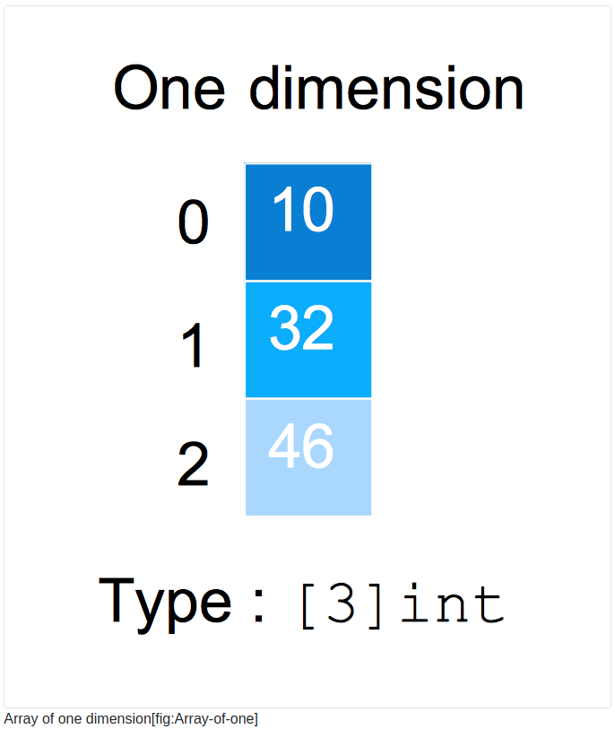
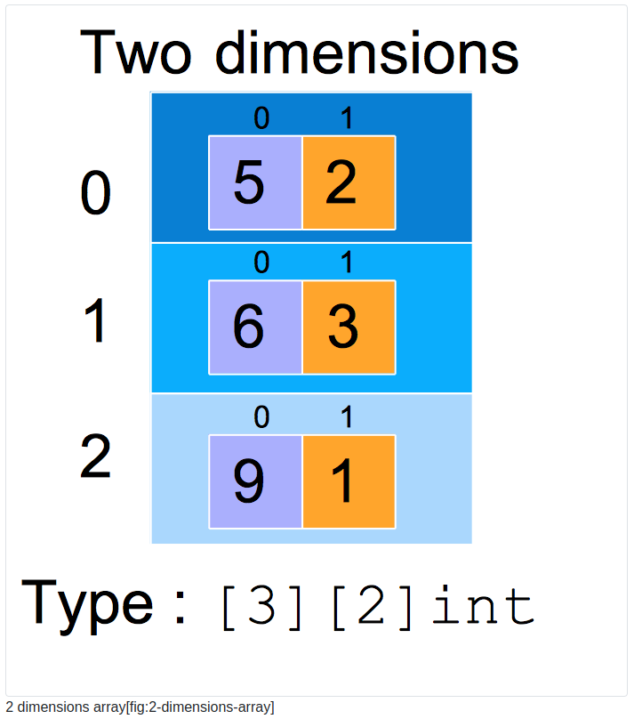

# Chapter 20: Arrays

## 1 What will you learn in this chapter?

- What is an array?

- How to create an array.

- How to create multidimensional arrays.

- How to iterate over an array.

- How to find an element in an array.

## 2 Technical concepts covered

- array

element type

- length

- capacity

  dung lượng

- dimension of arrays

  kích thước của mảng

## 3 Definition

- An array is a collection of elements of the same type.

- The type of elements inside an array is called the Element Type

  Kiểu phần tử bên trong một mảng được gọi là Kiểu phần tử

- This collection has a fixed number of elementsknown at compile time.

  Tập hợp các phần tử này có số lượng phần tử cố định được biết đến tại thời điểm biên dịch .

## 4 Array creation

```go
// array/creation/main.go
package main

import "fmt"

func main() {
    var myArray [2]int
    myArray[0] = 156
    myArray[1] = 147
    fmt.Println(myArray)
    // output : [156 147]
}
```

We define an array of 2 integers and directly populate it by using the array literal [n]T{}

chúng ta định nghĩa một mảng gồm 2 số nguyên và trực tiếp điền vào đó bằng cách sử dụng mảng: **[n]T{}**

```go
myArray := [2]int{156,147}
fmt.Println(myArray)
// output : [156 147]
```

You can also let the compiler infer the size of our array by using the syntax [...]T{}. For instance:

Bạn cũng có thể để trình biên dịch suy ra kích thước của mảng bằng cách sử dụng cú pháp [...]T{}. Ví dụ:

> myArray := [...]int{156, 147}

## 5 Zero value

When you define an array, you do not have to know all the values you want to put in it.

Khi bạn định nghĩa một mảng, bạn không cần phải biết tất cả các giá trị bạn muốn đưa vào đó.

You can create an empty array and fill it during the program execution. **But remember there are no undefined elements in Go**.

Bạn có thể tạo một mảng rỗng và điền vào trong khi thực hiện chương trình. Nhưng hãy nhớ rằng không có phần tử nào không xác định trong Go .

When you define an empty array go will fill it with the zero value of the element type:

Khi bạn định nghĩa một mảng rỗng, go sẽ điền giá trị bằng không của kiểu phần tử vào mảng đó:

```go
// array/zero-value/main.go
package main

import "log"

func main() {
    var myA [3]int
    log.Printf("%v", myA)
}

// 2021/01/27 17:56:21 [0 0 0]
```

## 6 Built-in functions

### 6.1 len: length

### 6.2 cap: capacity

- The **cap** built-in function returns the same as the len function. It is not useful in the context of arrays but will be very convenient when manipulating slices.

- fucntion **cap** trả về giống như hàm len. Nó không hữu ích trong bối cảnh mảng nhưng sẽ rất thuận tiện khi thao tác với các slice.

## 7 Iterating over an array

### 7.1 Ignore the index (or the value)

Sometimes you are just interested in the value, not the indexes. You can use the following syntax to ignore the index, you can do the same for the value :

Đôi khi bạn chỉ quan tâm đến giá trị, không phải chỉ mục. Bạn có thể sử dụng cú pháp sau để bỏ qua chỉ mục, bạn có thể làm tương tự với giá trị:

```go
for _, element := range myArray {
    fmt.Println(element)
}

for index, _ := range myArray {
    fmt.Println(index)
}
```

## 8 How to pass arrays to functions?

- This is an easy mistake: passing an array to a function will copy the array.

  Đây là một lỗi dễ mắc phải: truyền một mảng tới một hàm sẽ sao chép mảng đó.

- When you want to modify the array in the function pass a pointer to the array

  Khi bạn muốn sửa đổi mảng trong hàm, hãy truyền một con trỏ tới mảng

- Attention! If your array is large making copies of it can impact the performance of your program.

  Lưu ý! Nếu mảng của bạn lớn , việc sao chép có thể ảnh hưởng đến hiệu suất của chương trình.

### 8.1 Example

- Case 1: pass array to params function with copy value

```go
func main() {
	testArray := [2]string{"Value1", "Value2"}
	UpdateArray1(testArray)
	fmt.Println(testArray)
	fmt.Println("------")
}

const NewValue = "changedValue"

func UpdateArray1(array [2]string) {
	array[0] = NewValue
	fmt.Println(array)
}
```

- Case 2: pass array to params function with modify original value

To modify the original array, the function should take an element of type\*[2]string. This is a pointer type. It signals that the function can take any pointer to values of type [2]string (which is called the base type). A pointer is an address that points to a space in memory.

Để sửa đổi mảng ban đầu, hàm phải lấy một phần tử kiểu \*[2]string. Đây là một loại con trỏ. Nó báo hiệu rằng hàm có thể đưa bất kỳ con trỏ nào tới các giá trị của chuỗi kiểu [2] (được gọi là base type). Con trỏ là một địa chỉ trỏ đến một khoảng trống trong memory.

```go
func main() {
	testArray := [2]string{"Value1", "Value2"}
	UpdateArray1(&testArray)
	fmt.Println(testArray)
  fmt.Println("------")
}

const NewValue = "changedValue"

func UpdateArray1(array *[2]string) {
	array[0] = NewValue
	fmt.Println(array)
}
```

### 8.2 How to copy an array

- Case 1: Copy array without change value original array

```go
func TestArrayCopy(t *testing.T) {
    testArray := [2]string{"Value1", "Value2"}
    newCopy := testArray
    testArray[1] = "updated"
    fmt.Println(newCopy)
    fmt.Println(testArray)

  // ["Value1", "Value2"]
  // ["updated", "Value2"]
}
```

- Case 2: Copy array with change value original array

```go
func TestArrayCopy(t *testing.T) {
    testArray := [2]string{"Value1", "Value2"}
    newCopy := &testArray
    testArray[1] = "updated"
    fmt.Println(newCopy)
    fmt.Println(testArray)

  // ["updated", "Value2"]
  // ["updated", "Value2"]
}
```

## 9 Two-dimensional arrays

The term “dimension” might generate anxiety in those who hate mathematics. You should not be afraid; the concept behind is very simple. To understand it, I recommend visualizing it. On figure 2 you can see a one dimension array (length is 3, and the elements are of type int).

Thuật ngữ “chiều” có thể gây lo lắng cho những người ghét toán học. Bạn không nên sợ hãi; khái niệm đằng sau rất đơn giản. Để hiểu nó, tôi khuyên bạn nên hình dung nó. Trên hình 2, bạn có thể thấy một mảng một chiều (độ dài là 3 và các phần tử có kiểu int).



When you store strings, integers, floats, booleans, bytes, complex numbers into an array, the dimension of this array is one.

When the values of our array is another array, we have a multidimensional array. You can see a two-dimensional array

Khi các giá trị của mảng của chúng ta là một mảng khác, chúng ta có một mảng nhiều chiều. Bạn có thể thấy một mảng hai chiều



To access a particular element in such an array, you can use the following syntax :

```go
value := a[2][0]

// 9
```

## 10 Limitations

Arrays are efficient, but their main limitation is their fixed size.

Mảng rất hiệu quả, nhưng hạn chế chính của chúng là kích thước cố định.

In a real-world situation, data that you want to store rarely have a size fixed at compile time. Therefore the Go creators have created the notion of slices. We will see how to manipulate them in a dedicated chapter.

Trong tình huống thực tế, dữ liệu bạn muốn lưu trữ hiếm khi có kích thước cố định tại thời điểm biên dịch. Do đó, những người sáng tạo Go đã tạo ra khái niệm về slices.

## 11 Key Takeaways

An array is a collection of elements of the **same type**

The size of an array is called the **length**.

The length of an array is **known at compile time**.

In other words, an array once created cannot grow

To iterate over an array, you can use a for loop (with or without a range clause)

When an array is passed to a function, it is copied, the function cannot modify it

When you pass to a function a pointer to an array, you make the function able to modify the array.

There is no built-in function to find an element in an array.
