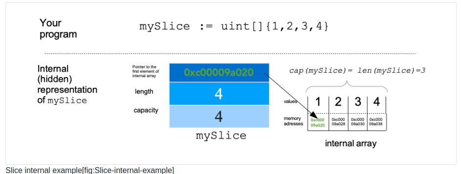
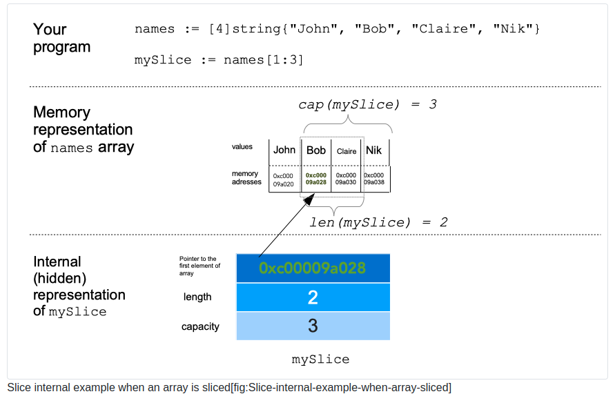

# Chapter 19 Slices

## 1 What will you learn in this chapter?

What is a slice?

How to create a slice.

How to iterate over a slice

How to create multi-dimensional slices.

How to put an element at a specific index in a slice.

How to use append and copy.

## 2 Technical concepts covered

Slice

Length

Capacity

Array

Copy

Pointer to

Variadic function

## 3 Definition

A slice is a **growable collection** of elements of the **same type**. It’s growable because you do not fix at compile time the size of your slice; you can add elements during the execution. When you add elements to the slice during the program execution, we say that the slice will grow.

Một slice là một tập hợp các phần tử cùng loại có thể phát triển được. Nó có thể phát triển được vì bạn không cố định kích thước lát cắt của mình tại thời điểm biên dịch; bạn có thể thêm các phần tử trong quá trình thực hiện. Khi bạn thêm các phần tử vào slice trong quá trình thực thi chương trình, chúng ta nói rằng slice sẽ phát triển.

The type of a slice is denoted by []T where T is the name of the type of elements inside the slice.

Kiểu của slices được ký hiệu là []T trong đó T là tên loại phần tử bên trong slices.

> []int: slices of intergers

Lưu ý rằng chúng ta không chỉ định kích thước của một slice như chúng ta làm với mảng. zero value của một slices là nil.

## 4 Creation of a new slice

```go
package main

func main() {
    s := make([]int, 3)
    s[0] = 12
    s[2] = 3

    s2 = []int{10,12}
}
```

Here we define the variable s that is of type []int which is a slice of integers. Then we can fill the slice. We define the elements at indexes 0 and 2.

Chúng ta có thể định nghĩa slices bằng cách dùng **make** hoặc bằng cách khai báo trực tiếp.

## 5 Slicing an array, a pointer to an array, or a slice

A slice is a piece of something. For instance, a slice of cheese is not the complete cheese but only a part of it. In Go, it’s the same you can slice:

Một slice là một phần của cái gì đó. Ví dụ, một lát pho mát không phải là pho mát hoàn chỉnh mà chỉ là một phần của nó. Trong Go, bạn có thể cắt lát tương tự như sau:

an array

a pointer to an array

a slice

The result of this operation (called slicing) is a slice. To slice an element, four you can use the following syntax :

Kết quả của thao tác này (được gọi là slicing) là một slices. Để cắt một phần tử, bốn bạn có thể sử dụng cú pháp sau:

> s := e[low:high]

low and high will allow you to select the range of elements in e

```go
package main

import "fmt"

func main() {
    customers := [4]string{"John Doe", "Helmuth Verein", "Dany Beril", "Oliver Lump"}
    // slice the array
    customersSlice := customers[0:1]
    fmt.Println(customersSlice)
}

// [John Doe]
```

Khi bạn sử dụng cú pháp slicing [low:high] trong Go, điều quan trọng cần nhớ là:

low: Chỉ số bắt đầu (bao gồm phần tử tại chỉ số này).
high: Chỉ số kết thúc (không bao gồm phần tử tại chỉ số này, hay còn gọi là excluded).

Cách tính số phần tử có thể lấy được: customers[0:1] sẽ có len = high - low = 1 - 0 = 1 phần tử.

## 6 Do slicing copy data?

```go
package main

import "fmt"

func main() {
    customers := [4]string{"John Doe", "Helmuth Verein", "Dany Beril", "Oliver Lump"}
    customersSlice := customers[0:1]
    fmt.Println(customersSlice)
    // modify original array
    customers[0] = "John Doe Modified"
    fmt.Println("After modification of original array")
    fmt.Println(customersSlice)
}

// [John Doe]
// After modification of the original array
// [John Doe Modified]
```

When we create the slice customersSlice the data is not copied, but a reference to the original data is taken. The value at index 0 in the slice will change.

Khi tạo một biến slice tư một array thì data sẽ không được copy mà lấy tham chiếu đến data gốc. Khi data gốc thay đổi thì giá trị của slice cũng thay đổi theo

## 7 Slicing a string

```go
hotelName := "Go Dev Hotel"
s := hotelName[0:6]
fmt.Println(s)

// Go dev
```

Strings in Go are **immutable**. Once created and saved in memory, you cannot modify the string.

Chuỗi trong Go là bất biến. Sau khi tạo và lưu vào bộ nhớ, bạn không thể sửa đổi

```go
func main() {
    hotelName := "Go Dev Hotel"
    s := hotelName[0:6]
    fmt.Println(s)
    hotelName = "Java Dev Hotel"
    fmt.Println(s)
}

// Go Dev
// Go Dev
```

## 8 Internal memory representation

Internally a slice is a struct that contains **a pointer to an array.**

Bên trong, một slice là một cấu trúc chứa con trỏ tới một mảng.

When we create a slice, Go will create an array. You will never have access to it. This array is internal.

When we slice an array, Go will take a pointer to that existing array.

The slice is the conjunction of three elements:

Lát cắt là sự kết hợp của ba yếu tố:

- A pointer to an underlying array. The pointer points to the underlying array where the slice begins. It points to the first element of the slice.

  Một con trỏ tới một mảng cơ bản. Con trỏ trỏ tới mảng bên dưới nơi lát cắt bắt đầu. Nó trỏ tới phần tử đầu tiên của slice.

- The length of the slice (an uint)

  Chiều dài của lát cắt (một uint)

- The capacity. (an uint)

When we create a slice in our program, an array will be created. This array will contain the elements of the slice. Internally Go will store a pointer to the first element of this array

Khi chúng ta tạo một slice trong chương trình của mình, một mảng sẽ được tạo. Mảng này sẽ chứa các phần tử của slice. Internal Go sẽ lưu trữ một con trỏ tới phần tử đầu tiên của mảng này



A slice can also be created by slicing an existing array. In this case, the slice’s capacity is not equal to its length.

Một slices cũng có thể được tạo bằng cách cắt một mảng hiện có. Trong trường hợp này, dung lượng của lát cắt không bằng chiều dài của nó.



Như trong hình ta có thể thấy là **len** và **cap** của slices đang không bằng nhau. Điều này là do:

- Length của slice: là số phần tử trong slice. Được tính bằng công thức:

> len = high - low

- Capacity của slice: Số phần tử tối đa mà slice có thể truy cập từ chỉ số bắt đầu (low) đến hết mảng gốc. Được tính bằng công thức:

> cap = len(mảng gốc) - low

## 9 Slices in function parameters

A function that takes a slice as parameter can change the underlying array. Why? Because a slice is internally a pointer to an underlying array. Here is an example :

Function lấy một slice làm tham số có thể thay đổi mảng cơ bản. Bởi vì một slice bên trong là một con trỏ tới một mảng cơ bản:

```go
package main

import "fmt"

func main() {
    s := []int{1, 2, 3}
    multiply(s, 2)
    fmt.Println(s)
    //[2 4 6]
}

func multiply(slice []int, factor int) {
    for i := 0; i < len(slice); i++ {
        slice[i] = slice[i] * factor
    }
}
```

Trong ví dụ trên có thể thấy tại vị trí khởi tạo slices _s_ và sau khi chạy qua func multily thì đã thay đổi do trong func đã thực hiện nhân lên giá trị trong slices

Mốt ví dụ nữa về cách sử dụng slices làm param trong function

```go
func main() {
    languages := []string{"Java", "PHP", "C"}
    fmt.Println("Capacity :", cap(languages))
    // Capacity : 3

    // call function
    addGo(languages)

    fmt.Println("Capacity :", cap(languages))
    // Capacity : 3
    fmt.Println(languages)
    // [Java PHP C]
    // what ! , where is Go ?????
}

func addGo(languages []string) {
    languages = append(languages, "Go")
    fmt.Println("in function, capacity", cap(languages))
}
```

Trong ví dụ này có thể thấy rằng là sau func _addGo_ thì ta vẫn k thấy giá trị mà ta thêm mới đâu cả. Ta vẫn biết slice là tham chiếu đến mảng gốc. Tuy nhiên, nó minh họa một khía cạnh quan trọng khác của slice: **khi slice cần mở rộng vượt quá capacity hiện tại, Go sẽ tạo ra một mảng mới và copy dữ liệu từ mảng gốc vào mảng mới**. Trong trường hợp này, việc thay đổi slice bên trong hàm sẽ không ảnh hưởng đến slice bên ngoài. với trường hợp này nếu ta muốn sau func _addGo_ hiển thị được giá trị mà ta đã add thì có thể return ra slices mới hoặc sử dụng pointer
