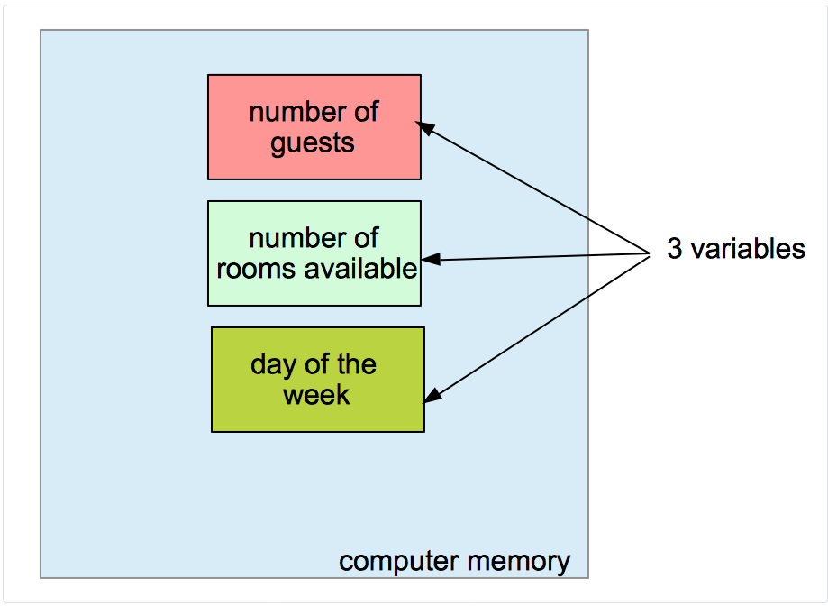
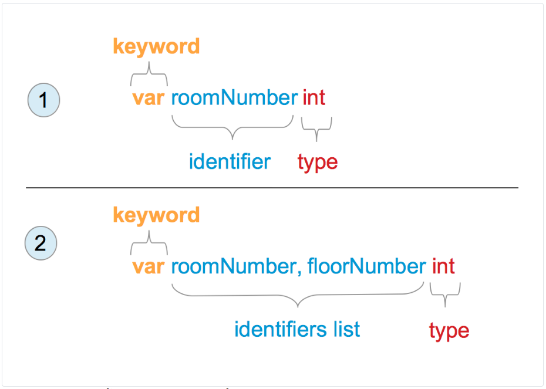
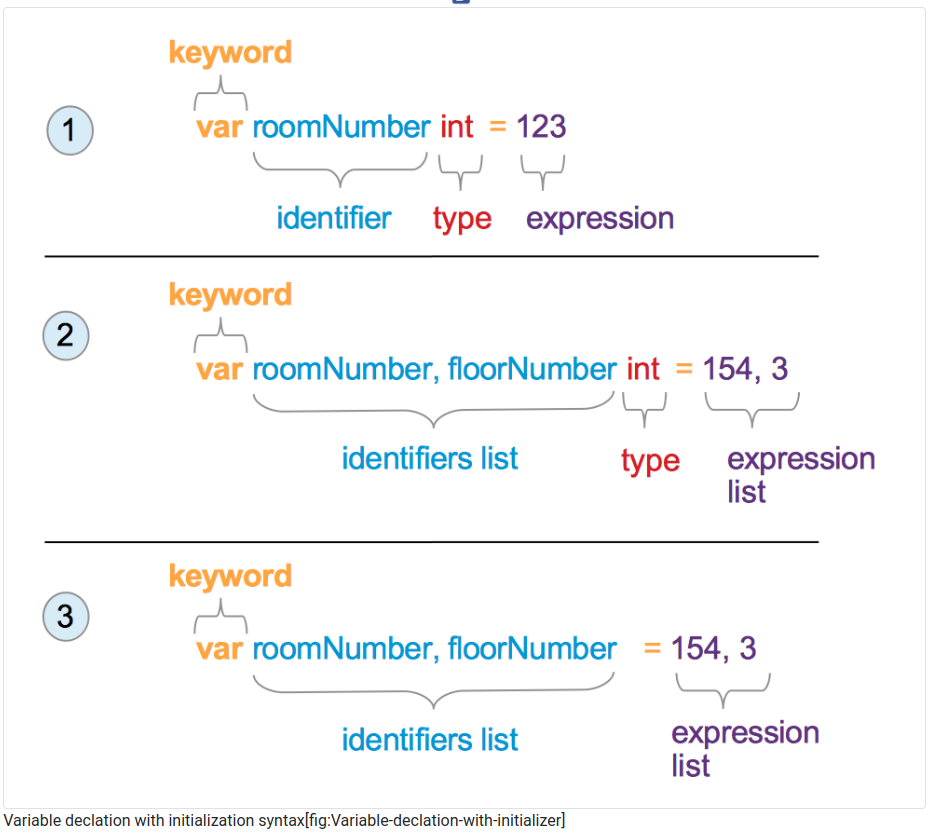
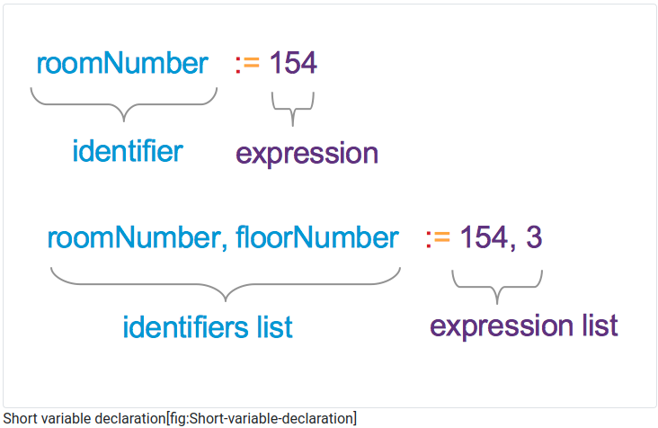
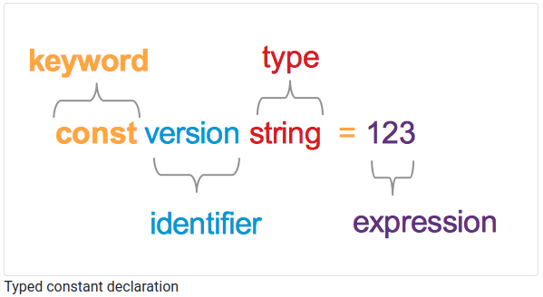

# Variables, constants and basic types

## 1. A variable is a space in memory

A variable is a space in the computer memory that can contain a changeable piece of data. The term “variable” comes from the Latin word “variabilis” which means “changeable”. In programs, we can create variables that will allow you to store information for later use.

For instance, we want to keep track of the number of guests in a hotel. The number of guests is a number that will vary. We can create a variable to store this information (see 1).



## 2. Where are variables stored

We talked previously about ROM, RAM, and auxiliary memory. Where is a Go variable stored? The answer is short; you cannot choose where it will be held. This is the responsibility of the compiler, not yours!

## 3. Variable identifier (name)

In most programming language (and also in Go), when we create a variable we associate it to an identifier. The identifier is the “name” of the variable. Giving identifiers to variables allow us to use them quickly in our program. An identifier is composed of letters and digits. The identifier of the variable will be used inside the program to designate the value that is stored inside. The identifier must be short and descriptive.

To create identifiers, programmers can be creative. But they must follow those simple rules :

1. Identifiers are composed of

- Unicode letters1

    - For example, A, a, B, b, Ô ...
- Unicode digits2

    - For example : 0,9,3,.…

2. The identifier must start with a letter or with the underscore character.“_”

3. Some identifiers cannot be used because they are reserved by the language

- **Reserved words** are : break, default, func, interface, select, case, defer, go, map, struct, chan, else, goto, package, switch, const, fallthrough, if, range, type, continue, for, import, return, var

## 4. Basic Types

We can store information into a variable. The term information is vague; we have to be more precise. Do we need to store digits (1, 2000, 3), floating-point numbers (2.45665), a text (“Room 112 non-smoking”)? A variable has a set of permissible values that we can assign to it. This set is the type of the variable. Types have names.

The Go language predeclares a set of basic types that you can use right away into your programs. You can also define your types (we will see it later). For the moment, we will focus only on the most used types :

- Character strings :

    - Type Name: string
    - Ex : “management office”, “room 265”,...
- Unsigned integers: 
    - Type names: uint, uint8, uint16, uint32, uint64
    - Ex : 2445, 676, 0, 1,...
- Integers
    - Type Names: int, int8, int16, int32, int64
    - Ex : -1245, 65, 78,...
- Booleans
    - Type Name: bool
    - Ex : true, false
- Floating point numbers
    - Type Name: float32, float64
    - Ex : 12.67

### 4.1. about the numbers 8, 16, 32 and 64

You may have noticed that we have five flavors of integers: int, int8, int16, int32, int64. The same is happening for unsigned integers. We have uint, uint8, uint16, uint32 and uint64. The choice is more limited for the floating-point numbers: we can use float32 or float64.

If you want to store a number that does not have a sign, you can use unsigned integers types. Those types come in 5 flavors:

- uint8

- unit16

- uint32

- uint64

- uint

Except for the last one, each one has a number appended to it. The number corresponds to the number of bits of memory allocated to store it.

If you have read the first section, you know that :

- with 8 bits of memory, we can store the decimal numbers from 0 to 2^7^ + 2^6^ + ... + 2^0^  = 255

- with 16 bits (2 bytes) we can store numbers from 0 to 2^15^ + 2^14^ + ... + 2^0^  = 65.535
- with 32 bits (2 bytes) we can store numbers from 0 to 2^31^ + 2^30^ + ... + 2^0^  = 4.294.967.295
- with 64 bits (2 bytes) we can store numbers from 0 to 2^63^ + 2^62^ + ... + 2^0^  = 18.446.744.073.709.551.615

You can note that the maximum decimal value of 64 bits is very high. Keep that in mind! If you need to store a value that does not exceed 255 use uint8 instead of uint64. Otherwise, you will waste storage (because you will only use 8 bits of the 64 bits allocated in memory !)

The last type is **uint**. If you use this type in your program, the memory allocated for your unsigned integer will be at least 32 bits. It will depend on the system that will run the program. If it’s a 32-bit system, it will be equivalent to uint32. If the system is 64 bits, then the storage capacity of uint it will be identical to the one of uint64. (to better understand the difference between 32 bits and 64 bits, you can take a look at the previous chapter)

## 5. Variable declaration

If you want to use a variable in your program, you need to declare it before.

### 5.1. The three actions performed when a variable is declared

When you declare a variable, it will :

- Bind an **identifier** to the variable

- Bind a **type** to the variable

- **Initialize** the variable value to the **default value** of the type

If you are used to programming the first two develop the first two actions are common. But the third one is not. Go initialize the value for you to the default of its type. Uninitialized variables do not exist in Go.

### 5.2. Variable declaration without an initializer



In the figure 2 you can see how to declare variables. In the first example, we declare one variable of type int named roomNumber. In the second one, we declare two variables in the same line : roomNumber and floorNumber. They are of type int. Their value will be 0 (which is the zero value of the type int).

```go
// variables-constants-and-basic-types/declaration-without-initializer/main.go
package main

import "fmt"

func main() {
    var roomNumber, floorNumber int
    fmt.Println(roomNumber, floorNumber)

    var password string
    fmt.Println(password)
}
```
The variable password of type string is initialized with the zero value of the type string, which is an empty string "". The variables roomNumber and floorNumber are initialized to the zero value of type int, which is 0.

### 5.3. Variable declaration with an initializer 



You can also declare a variable and initialize its value directly. The possible syntax is described in the figure 3. Let’s take an example :

```go
// variables-constants-and-basic-types/declaration-variant/main.go
package main

import "fmt"

func main() {
    var roomNumber, floorNumber int = 154, 3
    fmt.Println(roomNumber, floorNumber)

    var password = "notSecured"
    fmt.Println(password)
}
```

In the main function, the first statement declares two variables roomNumber and floorNumber. They are of type int and initialized with the values 154 and 3. Then the program will print those variables.

There is an expression or a list of expressions at the equal sign’s left. We will cover expressions in detail in another section.

Then we define the variable password. We initialize it with the value "notSecured". Note here that the type is not written. Go will give the variable the type of the initialization value. Here the type of "notSecured" is a string; thus, the type of the variable password is a string.

### 5.4. Short variable declaration



The short syntax eliminates the var keyword. The = sign is transformed into :=.You can also use this syntax to define multiple variables at once.

> roomNumber := 154

The type is not written explicitly. The compiler will infer it from the expression (or the expression list).

Here is an example :

```go
// variables-constants-and-basic-types/short-declaration/main.go
package main

import "fmt"

func main() {
    roomNumber, floorNumber := 154, 3
    fmt.Println(roomNumber, floorNumber)
}
```

- Warning : short variable declaration cannot be used outside functions !

```go
// will not compile
package main

vatRat := 20

func main(){

}
```

- Warning : you cannot use the value nil for a short variable declaration. The compiler cannot infer the type of your variable.

## 6. What is a constant?

Constant comes from the Latin word “constare” which means"standing firm". A constant is a value in your program that will stand firm, that will not change during the execution. A variable can change during the runtime; a constant will not change; it will stay constant.

For instance, we can store in a constant :

- The version of our program. For instance : “1.3.2”. This value will stay stable during program runtime. We will change this value when we compile another version of our program.

- The build time of the program.

An email template (if not configurable by our application).

- An error message.

In summary, use a constant when you are sure that you will never need to change a value during program execution. We say that a constant is immutable. Constants come in two flavors: typed and untyped.

## 7. Typed constants

Here is a typed constant :

> const version string = "1.3.2"

The keyword const signal to the compiler that we will define a constant. After the const keyword, the identifier of the constant is set. In our example, the identifier is “version”. The type is explicitly defined (here string) and also the value of the constant (in the form of an expression).



## 8. Untyped constants

Here is an untyped constant :

> const version = "1.3.2"

An untyped constant :

- has no type

- has a default type

- has no limits

### 8.1. An untyped constant has no type

Let’s take an example to demonstrate the first point (an untyped constant has no type)

```go
// variables-constants-and-basic-types/untyped-const/main.go
package main

import "fmt"

func main() {
    const occupancyLimit = 12

    var occupancyLimit1 uint8
    var occupancyLimit2 int64
    var occupancyLimit3 float32

    // assign our untyped const to an uint8 variable
    occupancyLimit1 = occupancyLimit
    // assign our untyped const to an int64 variable
    occupancyLimit2 = occupancyLimit
    // assign our untyped const to an float32 variable
    occupancyLimit3 = occupancyLimit

    fmt.Println(occupancyLimit1, occupancyLimit2, occupancyLimit3)
}
```
### 8.2. but a default type when needed 

To understand the notion of default type, let’s take another example

```go
// variables-constants-and-basic-types/default-type/main.go
package main

import "fmt"

func main() {
    const occupancyLimit = 12

    var occupancyLimit4 string

    occupancyLimit4 = occupancyLimit

    fmt.Println(occupancyLimit4)
}
```

In this program, we define a constant occupancyLimit which has a value of 12 (an integer). We define a variable occupancyLimit4 with a string type. Then we try to assign to occupancyLimit4 the value of our constant.

We try to convert an integer to a string. Will this program compile? The answer is no! The compilation error is :

>  ./main.go:10:19: cannot use occupancyLimit (type int) as type string in assignment

An untyped constant has a default type that is defined by the value assigned to it at compilation. In our example, occupancyLimit has a default type of int . An int cannot be assigned to a string variable.

- bool (for any boolean value)

- rune (for any rune value)

- int (for any integer value)

- float64 (for any floating-point value)

- complex128 (for any complex value)

- string (for any string value)

```go
// variables-constants-and-basic-types/untyped-default/main.go
package main

func main() {

    // default type is bool
    const isOpen = true
    // default type is rune (alias for int32)
    const MyRune = 'r'
    // default type is int
    const occupancyLimit = 12
    // default type is float64
    const vatRate = 29.87
    // default type is complex128
    const complexNumber = 1 + 2i
    // default type is string
    const hotelName = "Gopher Hotel"

}
```

### 8.3. An untyped constant has no limit 

An untyped constant has no type and a default type when needed. The value of an untyped constant can overflow its default type. Such a constant has no type; consequently, it does not depend on any type restriction. Let’s take an example :

```go
// variables-constants-and-basic-types/untyped-no-limit/main.go
package main

func main() {
    // maximum value of an int is 9223372036854775807
    // 9223372036854775808 (max + 1 ) overflows int
    const profit = 9223372036854775808
    // the program compiles
}
```

In this program, we create an untyped constant named profit. It’s value is 9223372036854775808
 which overflows the maximum value allowed for an int (int64 on my 64-bits machine) : 
9223372036854775807. This program compiles perfectly. But when we try to assign this constant value to a typed variable, the program will not compile. Let’s take an example to demonstrate it :

```go
// variables-constants-and-basic-types/untyped-no-limit-2/main.go
package main

import "fmt"

func main() {
    // maximum value of an int is 9223372036854775807
    // 9223372036854775808 (max + 1 ) overflows int
    const profit = 9223372036854775808
    var profit2 int64 = profit
    fmt.Println(profit2)
}
```

This program defines a variable profit2 which is of type int64. We then try to assign to profit2 the value of the untyped constant profit.

Let’s try to compile the program :

```go
$ go build main.go
# command-line-arguments
./main.go:9:7: constant 9223372036854775808 overflows int64
```

### 8.4. Why using constants?

- You improve the readability of your programs

    - The constant identifier, if well chosen, will give more information to the reader than the raw value
Compare this :

```go
loc, err := time.LoadLocation(UKTimezoneName)
if err != nil {
  return nil, err
}
```

To this:

```go
loc, err := time.LoadLocation("Europe/London")
if err != nil {
  return nil, err
}
```

We use the constant UKTimezoneName instead of the raw value "Europe/London". We hide the complexity of the timezone string to the reader. In addition to that, the reader will understand what our intention was; we want to load the UK’s location.

- You allow potential reuse of the value (by another program or in your own program)

- The compiler might improve the machine code produced. You say to the compiler that this value will never change; if the compiler is smart (and it is), it will ingeniously use it.

## 9. Choosing your identifiers (variable names, constant names)

Naming variables and constants is not an easy task. When you choose a name, you have to be sure that the selected name gives the right amount of information about its designation. The other developers that work on the same project will be thankful if you choose a good identifier name because reading the code will be easier. When we say “convey the right amount of information” the word “right” is vague. There are no scientific rules for naming program constructs. Even though there are no scientific rules, I can give you some advice shared among our community.

1. Avoid names with one letter: it conveys too little information about what is stored.

- The exception is for counters which are often named k, i and j (inside loops, that we will cover later)
2. Use camel case: this is a well-established convention in the go community.

- Prefer occupancyLimit to occupancy_limit3 or occupancy-limit4
3. No more than two words

- profitValue is good, profitValueBeforeTaxMinusOperationalCosts is too long
4. Avoid mentioning the type in the name

- descriptionString is bad, description is better

- Go is already statically typed; you do not need to give the type information to the reader. (In some loosely typed language, it’s sometimes necessary to avoid confusion)

## 10. Test yourself 

1. What is an identifier?

- An identifier is a set of characters composed of letters and digits.
2. By which type of character should an identifier begin?

- A letter or an underscore.
3. What is the type of a variable?

- The type of a variable is the set of permissible variable values.
4. What is a byte?

- A byte is composed of 8 binary digits
5. When you declare a variable of type bool. What is its value (right after initialization)?

- false. When you declare a variable, it is initialized to its type’s default value.
6.What are the three characteristics of an untyped constant?

- It has no type

- It has a default type

- It has no limit

## 11. Key takeaways

- The name of a variable or constant is called an identifier

- Identifiers are generally written using camelCase

- Variables and constants allow you to save a value in memory

- Constants are immutable, meaning that we cannot change their value during program execution

- Variables have a type, which defines the set of values they can hold

- When you create a variable, its value is initialized with the zero value of its type

    - This one is super important...

    - It can be a source of mistakes.

    - There are NO uinitialized variables in Go.

- There are two flavors of constants

    - Typed

    - Untyped

        - Have no type but a default one and can overflow their default type.

