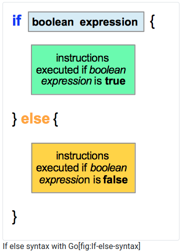
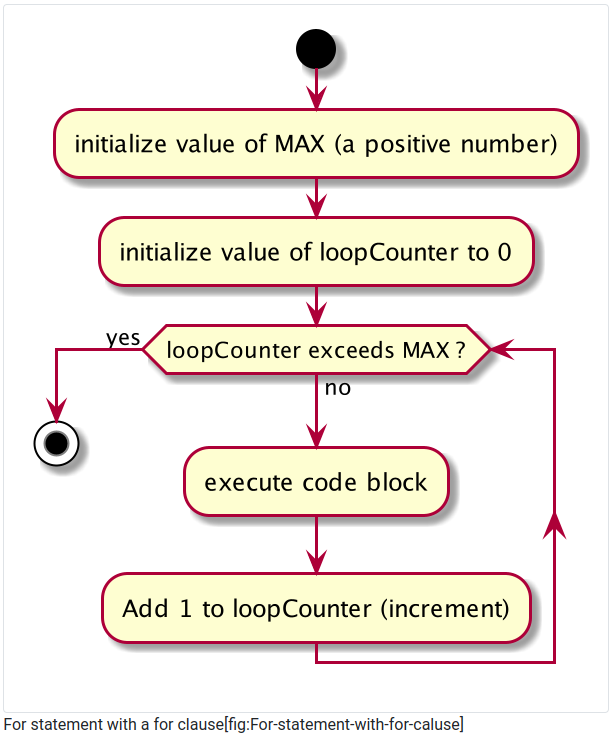

# Control Statements

## 1. Boolean Expressions

### 1.1. Definition

A boolean expression is a statement that will be evaluated at runtime and that should return either true or false. In other words, a boolean expression is a question that can be answered by true or false. Here are some examples :

- Is the room available?

- Has the customer paid his bill?

- Is the hotel full?

- Did we send a reservation email to the customer?

A boolean expression is evaluated at the program runtime, which means that when we create the program, we are not able to evaluate it.

The result will depend on the value of the data that the program will load. For instance, when we construct our program, we will load from a database the number of rooms available. We will put that number into a variable, and we will compare it to 0. If the rooms available is equal to 0, then the answer to “Is the hotel full?” is true.

### 1.2. Boolean expressions

Here are some examples of boolean expressions :

```go
// control-statements/boolean-expressions/main.go
package main

import (
    "fmt"
    "math/rand"
    "time"
)

func main() {
    rand.Seed(time.Now().UTC().UnixNano())
    var rooms, roomsOccupied int = 100, rand.Intn(100)

    fmt.Println("rooms :", rooms, " roomsOccupied :", roomsOccupied)

    // Example 1: is there more rooms than roomsOccupied
    fmt.Println("boolean expression : 'rooms > roomsOccupied' is equal to :")
    fmt.Println(rooms > roomsOccupied) //*\label{condExpBool1}

    // Example 2: is there more roomsOccupied than rooms
    fmt.Println("boolean expression : 'roomsOccupied > rooms' is equal to :")
    fmt.Println(roomsOccupied > rooms) //*\label{condExpBool2}

    // Example 3: is roomsOccupied equal to rooms
    fmt.Println("boolean expression : 'roomsOccupied == rooms' is equal to :")
    fmt.Println(roomsOccupied == rooms) //*\label{condExpBool3}
}
```

## 2. Comparison Operators

To compare the value of two values, you can use six operators :

| Operator      | Signification       |
| ------------- | ------------------- |
|      ==       |   equal             |
|      !=       |   not equal         |
|      >        |   greater           |
|      >=       |   greater or equal  |
|      <        |   less              |
|      <=       |   less or equal     |

Here is a program that uses all six operators :

```go
// control-statements/comparison-operators/main.go
package main

import "fmt"

func main() {
    a := 21
    b := 42

    fmt.Println(a == b) // false
    fmt.Println(a == a) // true
    fmt.Println(a != b) // true
    fmt.Println(a > b)  // false
    fmt.Println(a < b)  // true
    fmt.Println(a <= b) // true
    fmt.Println(a <= a) // true
    fmt.Println(a >= a) // true
}
```

The comparison operator used to test equality is == and not =. The last is the symbol used for assignment and not for comparison. Replacing == with = is a common mistake, so watch it.

## 3. If / else statement

### .3.1. Concept
An if-else statement allows you to execute instruction(s) when the value of a boolean expression is evaluated to true. When the value of the boolean expression is false, then another set of instructions are executed by the program. You can see on the figure 2 that an if statement generates two possible branches. When the boolean expression is evaluated to true, then the green set of instruction is executed. When the boolean expression is false, the other set of instructions is executed


### 3.2. Syntax


```go
// control-statements/if-else/main.go
package main

import (
    "fmt"
    "math/rand"
    "time"
)

func main() {
    rand.Seed(time.Now().UTC().UnixNano())
    var agePaul, ageJohn int = rand.Intn(110), rand.Intn(110)

    fmt.Println("John is", ageJohn, "years old")
    fmt.Println("Paul is", agePaul, "years old")

    if agePaul > ageJohn {
        fmt.Println("Paul is older than John")
    } else {
        fmt.Println("Paul is younger than John, or both have the same age")
    }
}
```

## 4. Nested if / else statements
### 4.1. Concept

You can nest if/else statement as many times as you wish. It can be useful if you want to create additional sub-branches. To better understand how it will work, you can look at the figure. 4. In this example, we have a first boolean expression (Boolean expresion 1). It will create two possible branches. The first branch (when the expression is true) will execute code 1. In the second branch, we have another if/else construction. It creates two additional branches. code 2 will be executed if Boolean expresion 2 is true (and code 3 if it is false)


### 4.2. Syntax


## 5. If without else

### 5.1. Concept

This type of statement is very common. It is the same as an if/else statement, without the else block. This statement will create a branch that will be executed if a boolean expression is evaluated to true.


### 5.2. Syntax


## 6. if / else if / else

### 6.1. Concept

Sometimes you will need to evaluate more than one boolean expression and create more than two branches.


### 6.2. Syntax


## 7. Switch case

### 7.1. Concept

With a switch statement, you can create branches in your program that will be executed depending on the value of an expression. This expression is called the “switch expression”. 


### 7.2. Syntax


## 8. For statement with a single condition

### 8.1. Concept

With a for statement, you can repeat the execution of a block of code several time. The number of executions depends on a condition. While the condition is not fulfilled, the block of code is executed. When the condition is fulfilled, the repetition stops.


### 8.2. Syntax


A for statement with a single condition is composed of the keyword **for**. Right after the keyword, we find the condition, which is followed by an open curly brace. Instructions that should be repeated are added after the opening brace. The for statement ends with a closing curly brace.

- Double-check your boolean expression to be sure that it will be false at some point in your program.

- If you have a boolean expression that is always true, your program will run indefinitely.

- You might have noticed, that syntactically the condition is optional. We will cover this later.

## 9. For statement with a for clause

This type of statement is conceptually the same as the previous one. In this for loop, we will need to add two statements :

- The init statement

- The post statement.

### 9.1. Concept

With a for loop, you can repeat the execution of instructions. The number of repetitions is usually defined with a counter (which is a variable). When the counter’s value exceeds a defined value, the repetition stops.



### 9.2. Syntax


