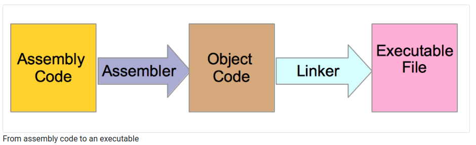
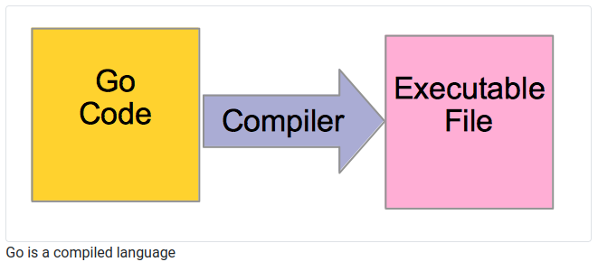

# Learning  Go Lang

## How to Write Hello, World! in Go

In there, create a new folder, for example call it hello.

In there, create a hello.go file (you can name it as you want).

Add this content:

```go
package main

import "fmt"

func main() {
	fmt.Println("Hello, World!")
}
```

Let’s analyze this line by line.

```go
package main
```

We organize Go programs in packages.

Each .go file first declares which package it is part of.

A package can be composed by multiple files, or just one file.

A program can contain multiple packages.

The main package is the entry point of the program and identifies an executable program.

```go
import "fmt"
```

We use the import keyword to import a package.

fmt is a built-in package provided by Go that provides input/output utility functions.

We have a [large standard library](https://pkg.go.dev/std) ready to use that we can use for anything from network connectivity to math, crypto, image processing, filesystem access, and more.

```go
func main() {
	
}
```

Here we declare the main() function.

What’s a function? We’ll see more about them later, but in the meantime let’s say a function is a block of code that’s assigned a name, and contains some instructions.

The main function is special because what’s where the program starts.

In this simple case we just have one function – the program starts with that and then ends.


## Chapter 1: Programming A Computer

### 1. Technical concepts covered

- Memory Unit, Arithmetic and Logic Unit, Input/Output, Control Unit

- Central memory, Auxiliary memory

- Volatile and non-volatile memory

- RAM/ROM

- CPU

- High and low-level languages

- Assembly language, assembler

- Compiled and interpreted language

### 2. The four hardware components

A computer is composed of four main parts :

The memory unit (MU) where data and programs are stored.

For instance, we can store into the memory unit the grades of a college class. We can also hold a program that will compute the class’s average grade.
The arithmetic and logic unit (ALU). Its role is to perform arithmetic and logical operations on data stored into the memory unit. This unit can perform, for instance, additions, incrementations, decrementations, which are called operations. In general, each operation requires two operands and output a result.

Let’s say we want to add 5 and 4. Those two numbers are the operands. The result of this operation is 9. Operands are loaded from the memory unit. The ALU is an electrical circuitry that is designed to execute operations.
The input and output unit (I/OU) will be in charge of loading data into the memory unit from an input device. This unit also sends data from the memory unit to an output device.

An input device is, for example, the touchpad of your computer, your keyboard, your mouse.

An output device is, for instance, your monitor.

The control unit (CU) will receive instructions from programs and will control the activity of the other units.

The four hardware components represent a schematic view of the computer’s components.

### 3. Memory

A computer is composed of two types of memory :

- The central memory

- The auxiliary memory

Two categories of memory exist:

- Volatile

- Non Volatile

#### 3.1. The central memory

This type of memory is necessary to run the operating systems and all the other programs your computer will run. The central memory contains two types of storage:

- **RAM** (Random Access Memory). This type of storage requires electric power to persist data. When you turn your computer off, the memory contained in this type of storage will be erased. The operating system and the programs you use will be loaded into this memory. This type of memory is volatile.

- **ROM** (Read-Only Memory). This is a memory that contains data necessary for the computer to run correctly. This kind of memory is not volatile (when you turn the computer off, it will not be erased). It’s designed to be only readable and not updated by the system.

#### 3.2. The auxiliary memory

This type of memory is not volatile. When the power is going off, the data stored will not be erased. Here are some examples of auxiliary memory: Hard drives, USB keys, CD-ROM, DVD ...etc.

Read and writes to this type of memory is **slow** compared to the **RAM**.

Some hard drives sequentially access memory. The system should respect a particular sequence. Respecting this access sequence takes a longer time than a random access mode. Note that some hard drives allow random memory access.

##### 3.2.1 SSD hard drive

Hard drives, also denoted Hard Disk Drive (HDD), are composed of magnetic disks that are rotating. Data are read and write thanks to a moving magnetic head. Reads and writes will generate a rotation and a magnetic head movement, which consumes time.

SSD (Solid-State Drives) are not constructed like that. There is no magnetic head neither magnetic disks. Instead, data is stored in flash memory cells. Data access is quicker on that kind of disk. Note that SSD also costs more than traditional electromagnetic hard drives.

### 4. CPU

CPU is the initials of Central Processing Unit. The CPU is also denoted processor. The CPU contains :

- The arithmetic and logic unit (ALU)

- The control unit (CU)

The CPU will be responsible for executing the instructions given by a program. For instance, the program can instruct to perform an addition between two numbers. Those numbers will be retrieved from the memory unit and passed to the ALU. The program might also require performing an I/O operation like reading data from the hard drive and loading it into the RAM for further processing. The CPU will execute those instructions.

The CPU is the central component of a computer.

### 5. What is a program

To make computers do something, we have to feed them with precise instructions. This set of instructions is called “program”.

Following a more official definition, a program is “a combination of computer instructions and data definitions that enable computer hardware to compute”

Let’s take an example. Imagine a program that asks the user to type two numbers. The program adds those numbers, and the result is then displayed on the monitor. The instructions that have to be written are :

1. Output “Please type your first number and press enter” on the monitor.

2. When a number is typed and the “Enter” key is pressed on the keyboard, store the number into memory. Let’s denote A this number.

3. Output “Please type your second number and press enter” on the monitor.

4. When a number is typed and the “Enter” key is pressed on the keyboard, store the number into memory. Let’s denote B this number.

5. Send to the ALU the two numbers (A and B) and the addition opcode and store the result into memory.

6. Output the result on the monitor

Two types of instructions are performed :

**I/O operations**: store numbers into memory from an the input device (the keyboard), load data from memory, retrieve numbers stored into memory, and display it to the user.

**An arithmetic operation**: add two numbers.

### 6. How to speak to the machine

#### 6.1. Programming languages are formal languages

Instructions that are given to the machine are written with programming languages. Programming languages are formal languages.They are composed of words that are constructed from an alphabet (a set of distinct characters). Those words are organized following specific rules. Go is a programming language, like x86 Assembly, Java, C, C++, Javascript...

They are two types of programming languages :

- Low level

- High level

Some high-level languages are compiled, others are interpreted, and some are in between. We will see in the next sections what those two terms mean.


#### 6.2. Machine language

To speak to the processing unit of a computer, we can use a machine language. Machine languages are composed exclusively of zeros and ones. An instruction written in a machine language is a suite of 0 and 1. Each processor (or family of processors) will define a list of instructions called the instruction set. There is an instruction to add to the number, increment by one, decrement by one, copy data from one location in memory to another place...etc.

It’s possible to write computer programs directly into machine language. However, this is not easy.

#### 6.3. Assembly language

The assembly language is a **low-level programming language**. The instructions of a program written in an assembly language correspond to machine instructions. Assembly languages use mnemonics which are small words that will correspond to a machine instruction. For instance 
MOV Will instruct the machine to move data from one location to another location. Developers can also comment the code (which is not possible with machine language).

To create a program in assembly language, the developer will write instruction to one or several files. Those files are named **source files**.

Here is an example of an instruction written in x86 Linux assembly:

```go
// assembly code
mov    eax,1
int    0x80
```

Those two lines will perform a system call that will close the program (the “1” represent the system call number that means “exit the program”). Note that assembly language is different from machine to machine. We say that it’s machine-specific.

An assembler is used to convert the source files written in an assembly language to object code files. We say that we assemble the program. The linker will then transform those object code files into an executable file. An executable file contains all the computer’s necessary instructions to launch the program.



#### 6.4. High-level languages

There are plenty of high-level languages on the market, like Go. Those languages are not closely bound to machine architecture. They offer a convenient way to write instructions. For instance, if we want to make a system call to exit our program, we can write in go :

```go
os.Exit(1)
```

With the C language, we can write :

```c
exit(1)
```

With Java, we can write :

```java
System.exit(1);
```

In this example, we do not have to move a number into a register; we use the languages constructs (functions, packages, methods, variables, types ...). The objective of this book is to give you precise and concise definitions of those tools to build Go applications.

High-level programs are also written to files. Files are named “source files”. Generally, programming languages require adding a specific extension to the filename. For Go programs we will add “.go” At the end of each file that we will write. In PHP the extension is “.php”.

When source files are written, the program that they define cannot be executed immediately. The source file needs to be compiled by using a compiler. The compiler will transform source files into an executable. The compiler is also a program. Go is part of the compiled language family.



##### 6.4.1. Compiled vs. Interpreted

Note that some programming languages are interpreted. When the source files have been written, the programmer does not need to compile the sources. With the source files ready, the system can execute the program thanks to an interpreter. Each instruction written into the source file is translated and executed by the interpreter. In some cases, interpreters are storing in a cache a compiled version of the program to boost performance (the source files are not translated each time). PHP, Python, Ruby, Perl are interpreted languages.

### 7. Test yourself 

#### 7.1. Questions

1. Where are programs stored?

2. Reading data from a hard drive is slower than reading data from RAM. True or false?

3. Can you write into the ROM? True or false?

4. What are the two types of memory?

5. What is the definition of “volatile memory”?

6. Which program transforms code written assembly language into object code?

7. Which program transforms object code into an executable file?

8. Give two advantages of high-level languages compared to low-level languages?

9. Go is an interpreted language? True or false?

#### 7.2. Answers

1. Where are programs stored?

- Into the memory unit (MU)
2. Reading data from a hard drive is slower than reading data from RAM. True or false?

- True. Fetching and writing data to the RAM is blazing fast, whereas accessing data stored into hard drives generally takes longer.
3. A computer user can write ROM? True or false?

- False. This type of memory can only be read. It is used to store the OS (Operating system)
4. What are the two types of memory?

- The central memory

- The auxiliary memory

5. What is the definition of “volatile memory” ?

- Volatile memory will be erased when the computer is switched off.
6. Which program transforms code written assembly language into object code?

- The assembler will take as input assembly language code and generate machine code.
7. Which program transforms object code into an executable file?

- The linker
8. Give two advantages of high-level languages compared to low-level languages?

- They offer high-level constructs that are easier to use.

- The code will not be specific to the technical architecture of a machine. We say that the code is portable.

9. Go is an interpreted language? True or false?

- False: Go is a compiled language

### 8. Key takeaways

1. At the macro-level, a computer is composed of :

- A memory unit (MU): to store data and programs

- An Arithmetic and Logical Unit (ALU): to perform computation

- An Input and Output Unit (IOU): to manage input devices and output devices.

- A Control Unit (CU) will manage the MU, ALU, and IOU following the instruction given by the program executed

2. CPU means Central Processing Unit (also called processor or microprocessor) is composed of the ALU and CU.

3. A program is a set of instructions.

4. Developers write programs with a programming language.

5. Programming languages are composed of words and characters that must be ordered following specified rules.

6. They are high and low-level programming languages.

7. Machine language and assembly language are low-level. The instructions written in those languages are closely linked to the hardware organization and capabilities. They provide little abstractions.

8. Go is a high-level programming language that is compiled.


