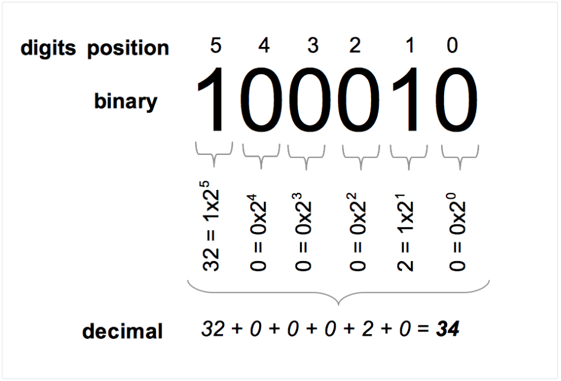
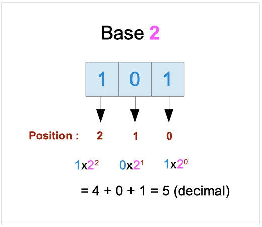
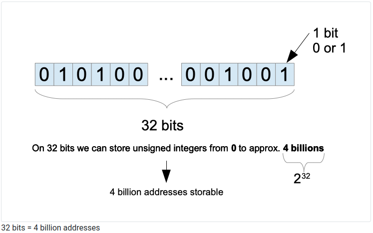
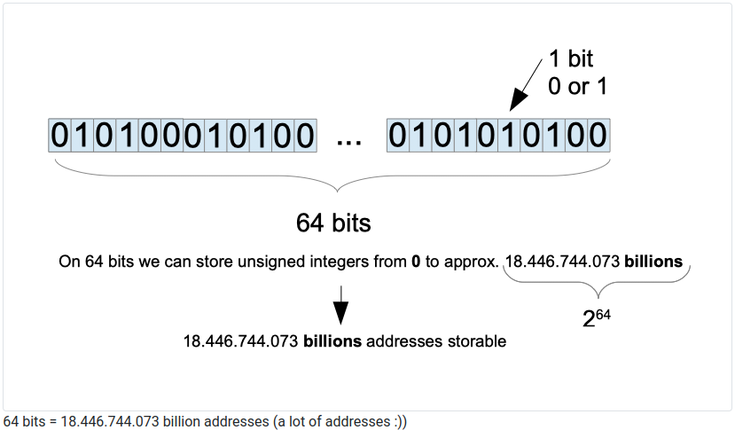

# Binary and Decimal

## 1. Introduction: Numerals, numbers, and quantity

- **Numeral** : a symbol or a group of characters that represent a number1

- **A number**: represent a quantity, something that we can count.

- **A numeral**: is a representation of a number.

- **A numeration system**: is a set of rules that allow us to count things and to represent quantities.

Every day we manipulate numbers represented with the decimal system: 10.254 , 125, 2020, 31 .…

But **the decimal system is not the only one** and was not always used.

We can represent numbers using other numeration systems.

- Let’s take as an example the quantity “one hundred twenty-three”

    “123” represent this quantity in the decimal system
    - The numeral is “123”
    “1111011” represent this quantity in the binary system
    - The numeral is “1111011”
    “7B” represent this quantity in the hexadecimal system
    - The numeral is “7B”
    “173” represent this quantity in the octal system
    - The numeral is “173”

The same quantity, the same underlying reality can be expressed in different forms.

Why is it important to understand that? Because computers will not store data using the decimal system. At the physical level, information is stored using zeros and ones.

This chapter will detail how the decimal system and the binary system work.

## 2. Etymology and symbols

Decimal comes from the Latin word “Decimus” which means “tenth”. Whereas binary comes from the Latin “bini” which means “two together”. The etymology of those two words give us a hint about how those systems are constructed :

- The binary system uses two symbols which are 0 and 1

- The decimal system uses ten symbols which are 0, 1, 2, 3, 4, 5, 6, 7, 8, 9.

Data written using the binary system will be written using “0” and “1”. For instance, 101010 is written using the binary encoding system.

Data written using the decimal system will be written using 0, 1, 2, 3, 4, 5, 6, 7, 8, 9. For instance, 42 is written using the decimal system. The number 10 can be encoded using the binary system or the decimal system (and thus, it will not represent the same underlying quantity).

## 3. The decimal system

Let’s take a look at a number written using the decimal system :

```bash
123
```

This number is one hundred twenty-three. This number is composed of “digits”. The first digit represents the number of hundreds. The second digit is the number of tens. The last digit is the number of ones. The decimal system is positional. This means that the contribution of a digit to the number depends on the digit’s position in the number.


Let’s take a step further. We can write the number one hundred with the number ten :

>100=10×10

We can use powers of ten :

> 10×10=10^2^

10^2^ is the equivalent of 10×10. We say that 10 is the base and 2 is the the power. When we read it, we say ten raised to the power of 2. Following the same logic, we can write :

> 10=10^1^ and 1=10^0^

The last one may seem strange. This is a mathematical rule: any non-zero number raised to 0 is equal to 1.

With that in mind, we can decompose the number 123 with powers of ten

> 123 = 1×10^2^ + 2×10^1^ + 3×10^0^

If you read 1×10^2^ + 2×10^1^ + 3×10^0^ from left to right, you can note that the power of 10 is decreasing one by one.

This power often correspond to the position of the digit when the number is written down.

- the digit “1” is at the position 2 (1×10^2^)
- the digit “2” is at the position 1 (2×10^1^)
- the digit “3” is at the position 0 (3×10^0^)

The way I counted the positions might be surprising to you. You expected maybe something like that :

- the digit “1” is at the position 3
- the digit “2” is at the position 2
- the digit “3” is at the position 1

This is entirely correct if you start the count with 1, but we start the count with zero. Remember this convention because it will help you later!


The relation between decimal digits and powers of ten
In conclusion, the relation between the numeral and the number is the following. :
For a given numeral :

> digit^2^digit^1^digit^0^

The corresponding number (quantity) is :

> digit~2~ × 10^2^ + digit~1~ × 10^1^ + digit~0~ × 10^0^

Of course, this relation is valid for numerals with more (and less) than Three digits!

### 3.1. Fractional numbers

We have seen how the system works for round quantities; what about fractional numbers (numbers with a “decimal separator”, like 123.14)

There is still a relationship with the power of tens.

> 123.45 = 1×10^2^ + 2×10^1^ + 3×10^0^ + 4×${1 \over 10^1}$ + 5×${1 \over 10^2}$

This makes sense because:
> ${1 \over 10^1}$ = ${1 \over 10}$ = 0.1

- So, 4×${1 \over 10^1}$ = 0.4

${1 \over 10^2}$ = ${1 \over 100}$ = 0.05

- So, 5×${1 \over 10^2}$ = 0.05

## 4. The binary system

A number written in binary is composed of zeros and ones. The binary system, like the decimal system, is a positional numeral system. It means that each digit has a value that depends on its position. It’s a base two system (the decimal system is base 10).

Let’s take a look at a binary number :

10~binary~

Note that I added the subscript “binary” to the number because this number also exists in the decimal system. The decimal number 10 is NOT equal to the binary number 10. It does not express the same quantity. 10~binary~ is a numeral composed of two binary digits. The term binary digit has a widely used abbreviation: bit. We can get the decimal equivalent of this number by using powers of two :

> 10~binary~ = (1 × 2^1^ + 0 × 2^0^)~decimal~

> 10~binary~ = (1 × 2)~decimal~

> 10~binary~ = 2~decimal~

The binary number 10~binary~ represents the same quantity than 2~decimal~. It is two units. Let’s take another example.

>100010~binary~

We will find its decimal representation. We take each digit; we multiply it by **2^x^** where *x* is the position of the digit in the binary number 


Binary to decimal conversion



By the way, there is a famous joke that I heard once from a colleague about this: “There are ten types of people in the world, the ones that understand binary and the others” :)

##  5. Storage capacity
### 5.1.  The storage capacity of 2 bits

What is the maximum decimal number we can store in a two binary digit number? Here is the list of the binary numbers that are composed of 2 digits: 

00~binary~ = (0 × 2^1^ + 0 × 2^0^)~decimal~ = 0~decimal~
01~binary~ = (0 × 2^1^ + 1 × 2^0^)~decimal~ = 1~decimal~
10~binary~ = (1 × 2^1^ + 0 × 2^0^)~decimal~ = 2~decimal~
11~binary~ = (1 × 2^1^ + 1 × 2^0^)~decimal~ = 3~decimal~

With two binary digits, we can store the numbers 0~decimal~ to 3~decimal~. The maximum number that can be stored is 3~decimal~

### 5.2. The storage capacity of 3 bits

What is the maximum decimal number we can store in a three binary digit number? Here is the list of the binary numbers that are composed of 2 digits :

000~binary~ = (0 × 2^2^ + 0 × 2^1^ + 0 × 2^0^)~decimal~ = 0~decimal~
001~binary~ = (0 × 2^2^ + 0 × 2^1^ + 1 × 2^0^)~decimal~ = 1~decimal~
010~binary~ = (0 × 2^2^ + 1 × 2^1^ + 0 × 2^0^)~decimal~ = 2~decimal~
011~binary~ = (0 × 2^2^ + 1 × 2^1^ + 1 × 2^0^)~decimal~ = 3~decimal~
100~binary~ = (1 × 2^2^ + 0 × 2^1^ + 0 × 2^0^)~decimal~ = 4~decimal~
101~binary~ = (1 × 2^2^ + 0 × 2^1^ + 1 × 2^0^)~decimal~ = 5~decimal~
110~binary~ = (1 × 2^2^ + 1 × 2^1^ + 0 × 2^0^)~decimal~ = 6~decimal~
111~binary~ = (1 × 2^2^ + 1 × 2^1^ + 1 × 2^0^)~decimal~ = 7~decimal~

We can store all the numbers between **0~decimal~** and **7~decimal~** and the maximum decimal number that can be stored on 3 bits is **7~decimal~**

### 5.3. The storage capacity of 8 bits (one byte)

What is the maximum decimal number we can store in an eight binary digit number? We could list all the different binary numbers that can be built, but it would be time-consuming. Did you notice in the previous sections that the maximum number is made with only ones? It seems logical when a binary number is composed of just ones; its decimal value will be equal to the sum of powers of two (from 0 to n) where n is the number of digits minus 1. If there is a single 0 digit in the binary number, the power of two corresponding is not counted.

11111111~binary~ = (1 × 2^7^ + 1 × 2^6^ + 1 × 2^5^ + 1 × 2^4^ + 1 × 2^3^ + 1 × 2^2^ + 1 × 2^1^ + 1 × 2^0^)~decimal~ = 255~decimal~

With 8 bits, we can store all the numbers between **0~decimal~** and **255~decimal~**. **8 bits** is called a **byte**. From 0~decimal~ to 255~decimal~ there are 256 numbers.

## 6. How to store images, videos,... ?

We detailed how to transform a decimal number into a binary number to store it in memory. I hope it was clear and exciting. It’s therefore not sufficient. Programs manipulate far more things than numbers.

We can build programs that use :

- Images

- Texts

- Movies

- 3D models

- .….

The answer is simple: at the end, even photos and movies will be stored using zeros and ones! We will convert them into binary. This job will be performed by specialized programs called encoders. An encoder will take as input a file from a specific format and will convert it into a destination format. In our case, the destination is binary.

We do not need to write those programs; they are all provided by Go. You need to understand that every file or chunk of data is stored under the hood using binary digits (bits).

The binary representation is just hidden from us.

## 7. 32 vs. 64 bits systems
### 7.1. Programs need memory

The processor of a computer is responsible for executing programs. Most programs need to store and access memory. If you write a program that will display “42” on the screen. Behind the scene, the number 42 needs to be stored somewhere. The system will also need to fetch it from memory.

This is done via an addressing system. Each bit of information is stored in a precise location in the memory unit And to get them, the processor needs to have the ability to get its full address.

Remember that there are two types of memory :

- The central memory: ROM and RAM

- The auxiliary memory: Hard drive, USB keys...

Here we consider only the central memory.

### 7.2. A memory address is a number

For a processor **an address is a number**. A memory address is like a postal address. It identifies precisely a point in memory space.

Processors will store addresses on registers. A register is a place inside the processor where an address can be saved for later use. For instance, let say that we have a program that makes an addition. Our program defines a variable that will hold the first value (let say 1.234) and another one that will store the second value (let say 1.290.999). When the processor executes our program, it will need to fetch the value 1.234 from memory and the value 1.290.999. The processor will save the two addresses on its registers.

### 7.3. Memory addressable: a limited resource

Registers have a limited capacity; they can store addresses of a specific size (written in bits). For a 16 bit processor, the maximum capacity of those registers is... 16 bits. For 32 bits processors, the maximum capacity is 32 bits. The same reasoning applies to 64 bits.

The maximum register capacity will define how much memory we can address.

Why? Remember that we store addresses on those registers and an address is a number:

- **On 32 bits** we can store numbers from 0 to 4.294.967.295 $\approx$ 2^32^
    - With 32 bits, we can store 4 billion unsigned numbers, 4 billion addresses.
- **On 64 bits** we can store numbers from 0 to 18.446.744.073.709.551.615 $\approx$ 2^64^
    - That makes a lot of addresses possible




### 7.4. The relation between the number of addresses possible and RAM size

RAM is a hardware component composed of memory cells. Bits are stored in cells. In general, RAM is said to be byte-addressable. It means that the system can fetch data 8 bits at a time.

We have seen that the size of a memory address is **limited** by the size of registers.

A 32-bit system can only handle addresses that are composed of 32 bits. Each bit is composed either of a 0 or a 1, which makes 2^32^ $\approx$ 4 billion possibilities.

- With 4 billion addresses, how many bytes can we address?
    - => 4 billion bytes !
    - We can convert this quantity into Gigabytes.
        - 1 Gigabyte = 1 billion bytes
        - So, 4 billion bytes = 4 Gigabytes

- With a 32 bits systems, 4 Gigabytes of memory can be accessed by the system. Installing more than 4 GB of RAM on a 32 bits system is useless.

    - On 64 bits systems, the number of addresses is much larger; hence the amount of memory addressable is bigger: theoretically 16 Exabytes
        - As a consequence, 16 Exabyte is theoretically the maximum amount of RAM addressable on a 64 bits computer.

## 8. Test yourself

1. What is a bit?

- This is the abbreviation of Binary Digit.

- It’s either a 0 or a 1

2. What is a byte?

- A byte is 8 bits

3. What is an encoder?

- An encoder takes input in a given format and transforms it into another form.

- The process is reversible.

4. What is the maximum amount of RAM that can be addressable by a 32 bit System?
- 4Gb

5. What is the decimal version of 001~binary~?
- 1

## 9. Key takeaways

- Numerals represent numbers

- Each numeration system has its way to represent numbers

    - 100 can be a number written in binary and decimal. It does not represent the same number/quantity!
- At the physical level, data is stored in memory using binary digits (0 and 1)

- A bit is one binary digit

- A byte is eight bits

- A 64-bit system can address far more memory than a 32-bit system.
