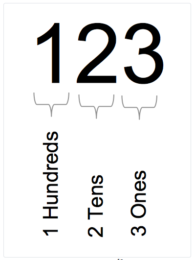
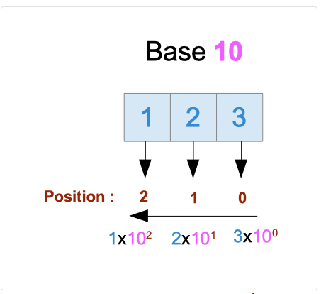

# Binary and Decimal

## 1. Introduction: Numerals, numbers, and quantity

- **Numeral** : a symbol or a group of characters that represent a number1

- **A number**: represent a quantity, something that we can count.

- **A numeral**: is a representation of a number.

- **A numeration system**: is a set of rules that allow us to count things and to represent quantities.

Every day we manipulate numbers represented with the decimal system: 10.254 , 125, 2020, 31 .…

But **the decimal system is not the only one** and was not always used.

We can represent numbers using other numeration systems.

- Let’s take as an example the quantity “one hundred twenty-three”

    “123” represent this quantity in the decimal system
    - The numeral is “123”
    “1111011” represent this quantity in the binary system
    - The numeral is “1111011”
    “7B” represent this quantity in the hexadecimal system
    - The numeral is “7B”
    “173” represent this quantity in the octal system
    - The numeral is “173”

The same quantity, the same underlying reality can be expressed in different forms.

Why is it important to understand that? Because computers will not store data using the decimal system. At the physical level, information is stored using zeros and ones.

This chapter will detail how the decimal system and the binary system work.

## 2. Etymology and symbols

Decimal comes from the Latin word “Decimus” which means “tenth”. Whereas binary comes from the Latin “bini” which means “two together”. The etymology of those two words give us a hint about how those systems are constructed :

- The binary system uses two symbols which are 0 and 1

- The decimal system uses ten symbols which are 0, 1, 2, 3, 4, 5, 6, 7, 8, 9.

Data written using the binary system will be written using “0” and “1”. For instance, 101010 is written using the binary encoding system.

Data written using the decimal system will be written using 0, 1, 2, 3, 4, 5, 6, 7, 8, 9. For instance, 42 is written using the decimal system. The number 10 can be encoded using the binary system or the decimal system (and thus, it will not represent the same underlying quantity).

## 3. The decimal system

Let’s take a look at a number written using the decimal system :

```bash
123
```

This number is one hundred twenty-three. This number is composed of “digits”. The first digit represents the number of hundreds. The second digit is the number of tens. The last digit is the number of ones. The decimal system is positional. This means that the contribution of a digit to the number depends on the digit’s position in the number.



Let’s take a step further. We can write the number one hundred with the number ten :

>100=10×10

We can use powers of ten :

> 10×10=10^2^

10^2^ is the equivalent of 10×10. We say that 10 is the base and 2 is the the power. When we read it, we say ten raised to the power of 2. Following the same logic, we can write :

> 10=10^1^ and 1=10^0^

The last one may seem strange. This is a mathematical rule: any non-zero number raised to 0 is equal to 1.

With that in mind, we can decompose the number 123 with powers of ten

> 123 = 1×10^2^ + 2×10^1^ + 3×10^0^

If you read 1×10^2^ + 2×10^1^ + 3×10^0^ from left to right, you can note that the power of 10 is decreasing one by one.

This power often correspond to the position of the digit when the number is written down.

- the digit “1” is at the position 2 (1×10^2^)
- the digit “2” is at the position 1 (2×10^1^)
- the digit “3” is at the position 0 (3×10^0^)

The way I counted the positions might be surprising to you. You expected maybe something like that :

- the digit “1” is at the position 3
- the digit “2” is at the position 2
- the digit “3” is at the position 1

This is entirely correct if you start the count with 1, but we start the count with zero. Remember this convention because it will help you later!



The relation between decimal digits and powers of ten
In conclusion, the relation between the numeral and the number is the following. :
For a given numeral :

> digit^2^digit^1^digit^0^

The corresponding number (quantity) is :

> digit~2~ × 10^2^ + digit~1~ × 10^1^ + digit~0~ × 10^0^

Of course, this relation is valid for numerals with more (and less) than Three digits!

### 3.1. Fractional numbers

We have seen how the system works for round quantities; what about fractional numbers (numbers with a “decimal separator”, like 123.14)

There is still a relationship with the power of tens.

> 123.45 = 1×10^2^ + 2×10^1^ + 3×10^0^ + 4×${1 \over 10^1}$ + 5×${1 \over 10^2}$

This makes sense because:
> ${1 \over 10^1}$ = ${1 \over 10}$ = 0.1

- So, 4×${1 \over 10^1}$ = 0.4

${1 \over 10^2}$ = ${1 \over 100}$ = 0.05

- So, 5×${1 \over 10^2}$ = 0.05