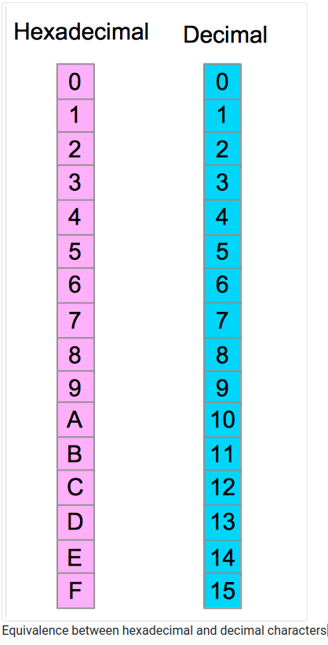
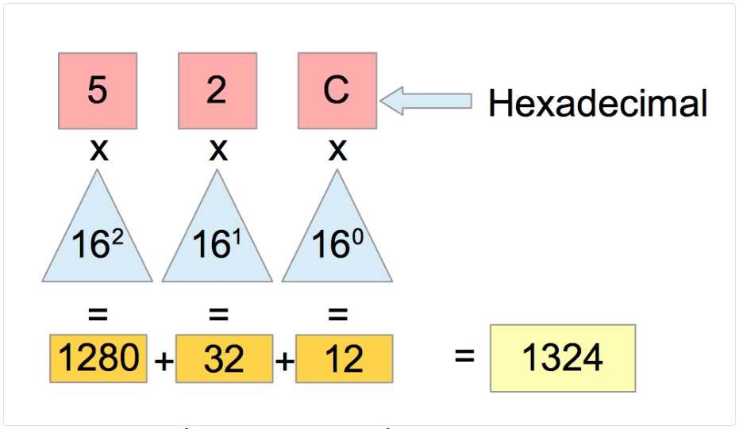
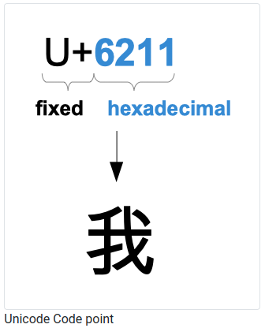
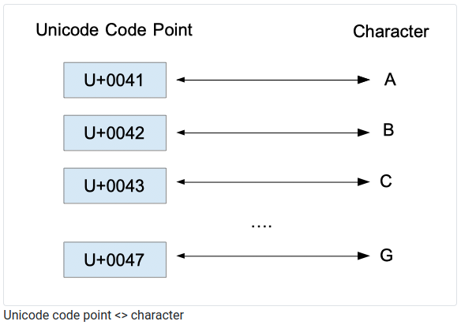
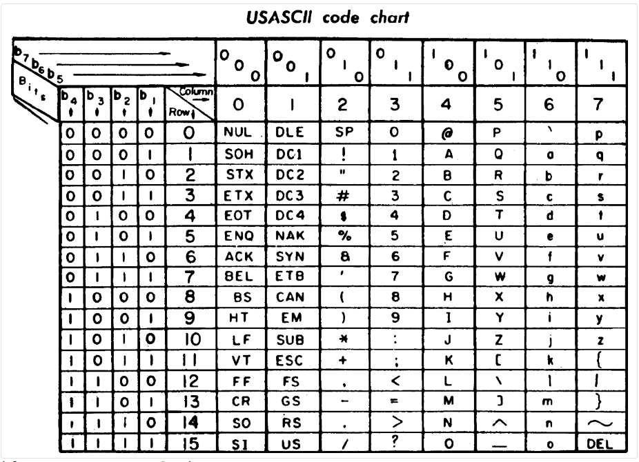

# Hexadecimal, octal, ASCII, UTF8, Unicode, Runes

## 1. Base 16: the hexadecimal representation

To represent a binary number, you need to align many zeros and one. This notation is verbose. To represent the decimal number 1324, we needed to use 11 characters in binary. That’s why we need to have a numbering system more convenient to express large numbers.

Hexadecimal is also a positional numeral system that uses 16 characters to represent a number.

- The prefix Hexa means 6 in Latin

- Decimal is coming from the Latin word Decem which means 10

Those characters are numbers and letters. We use the numbers from 0 to 9 (10 characters) and the letters from A to F (6 characters).

Let’s take an example: 1324 in base ten is equivalent to 52C in base 16



The digits from 0 to 9 correspond to the same value in the decimal system. The letters A correspond to 10, the letter B to 11 ...etc. This is a specificity of the hexadecimal numeral system; we use letters to represent numeric values.

Usually, this specificity generate confusion and questions to my students, what I typically reply is that you have to admit it; we needed more characters so we took letters...



You can see that we introduced in this notation letters. That’s because from 0 to 9, you have ten characters, ten digits, but with a base-16 numbering system, we need six more characters. That’s why we have taken the first six letters of the alphabet. This is a historical choice; other characters could have replaced letters, the system would have been still the same.

The method you can use to convert a hexadecimal number to a decimal number is similar to the previous one. We take the rightmost character we find its decimal equivalent, then we multiply it by 16 at the power 0. In our example, we have the letter C.The equivalent of C is 12.

To print the hexadecimal representation of a number, you can use fmt functions. :

```go
// hexadecimal-octal-ascii-utf8-unicode-runes/hexa-lower/main.go
package main

import "fmt"

func main() {
    n := 2548
    fmt.Printf("%x", n)
}
```
This program will output: 9f4 (which is the hexadecimal representation of the decimal number 2548)."%x" is the formatting verb for hexadecimal (with letters lowercase).

**If you want to represent a number in hexadecimal in your code, add 0x before the numeral :**

## 2. Base 8: the octal representation

I have almost forgotten another numeral system! The octal!

It uses a base 8, which means eight different characters. The numbers from 0 to 7 were chosen. The conversion from decimal to octal is similar to the methods that I have presented before. Let’s take an example :


We begin by the rightmost character, and we multiply it by eight at the power 0, which is 1. Then we take the next character: 5 to multiply it by eight at the power 1, which is 8...

The octal system is notably used to represent permissions on a file for Unix operating systems.

In the same fashion as hexadecimal, the fmt package defines two formatting verbs for octal :

```go
// /hexadecimal-octal-ascii-utf8-unicode-runes/octal/main.go
package main

import "fmt"

func main() {
    n2 := 0x9F4
    fmt.Printf("Decimal : %d\n", n2)

    // n3 is represented using the octal numeral system
    n3 := 02454
    // alternative : n3 := 0o2454

    // convert in decimal
    fmt.Printf("decimal: %d\n", n3)

    // n4 is represented using the decimal numeral system
    n4 := 1324
    // output n4 (decimal) in octal
    fmt.Printf("octal: %o\n", n4)
    // output n4 (decimal) in octal (with a 0o prefix)
    fmt.Printf("octal with prefix : %O\n", n4)

}
```

Output :

```go
Decimal : 2548
decimal: 1324
octal: 2454
octal with prefix : 0o2454
```

**"%o"** allow you to print the number in octal

**"%O"** allow you to print the number in octal with a **"0o"** prefix

## 3. Data representation bits, nibble, bytes, and words

Bit is an abbreviation for Binary digit .For instance 10100101100 is made of 11 binary digits, in other words, 11 bits. It’s very usual to group bits together. Groups exist in various sizes:

- A nibble is composed of 4 bits

- A byte is composed of 8 bits (two nibbles)

- A word is composed of 16 bits (two bytes)

- A doubleword is composed of 32 bits (two words)

- A quadword is composed of 16×4=64 bits (four words)

With Go, you can create a slice of bytes. Lots of common standard package functions and methods are taking as arguments slice of bytes. Let’s see how we can create a slice of byte.

```go
// /hexadecimal-octal-ascii-utf8-unicode-runes/slice-of-byte/main.go
package main

import "fmt"

func main() {
    b := make([]byte, 0)
    b = append(b, 255)
    b = append(b, 10)
    fmt.Println(b)
}
```

In the previous snippet, we created a slice of bytes (with the builtin make) then we appended to the slice two numbers.

Golang byte type is an alias of uint8. Uint8 means that we can store unsigned (without any signs, so no negative numbers) integers on 8 bits (a byte) of data. The minimum value is 0 (the binary digit 000000~2~) the maximum value is 255 (11111111~2~​ which is equivalent to the decimal number 2^7^ + 2^6^ + 2^5^ + 2^4^ + 2^3^ + 2^2^ + 2^1^ + 2^0^)

That’s why we can only append to a byte slice numbers from 0 to 255. If you try to append a number greater than 255, you will get the following error :

> constant 256 overflows byte

**To print the binary representation of a number, you can use the "%b" formatting verb :**

```go
// /hexadecimal-octal-ascii-utf8-unicode-runes/decimal-binary/main.go
package main

import "fmt"

func main() {
    n2 := 0x9F4
    fmt.Printf("Decimal : %d\n", n2)
    fmt.Printf("Binary : %b\n", n2)
}
```
Output:

```go
Decimal : 2548
Binary : 100111110100
```

## 4. What about other characters? 

What if you want to store something other than numbers? For instance how could we store this Haiku from Masaoki Shiki :

```bash
spring rain:
browsing under an umbrella
at the picture-book store
```

Is the byte type appropriate? A byte is nothing more than an unsigned integer stored on 8 bits. This Haiku is composed of letters and special characters. We have an“:” and a “-” we also have line breaks... How can we store those characters?

We have to find a way to give each letter and even special characters an unique code. You have maybe heard about UTF-8, ASCII, Unicode? This section will explain what they are and how they work. Once I started programming (that was not in Go), character encoding was something obscure, and I did not find it interesting. I think that character encoding could be essential because I have spent nights at work on problems that could have been resolved with a basic understanding of character encoding.

The history of character encoding is very rich. With the development of the telegraph, we needed a way to encode messages in a way that could be transportable on an electrical wire. One of the earliest attempts was the Morse code. It is composed of four symbols: short signal, long signal, short space, long space (Wikipedia). Each letter of the alphabet could be encoded in morse. For instance, A was encoded as a short signal followed by a long signal. The plus sign “+” was encoded with “short long short long short”.

## 5. Vocabulary

We need to define a common vocabulary to understand character encoding :

- Character This can be written by our hand. It conveys a signification. For instance, the sign “+” is a character. It means adding something to something else. A character can be a letter, a sign, or an ideogram.

- Character set: this a collection of distinct characters. Often you will see or hear the abbreviation “charset”.

- Code point : each character from a character set has an equivalent numeric value that uniquely identify this character. This numeric value is a code point.

## 6. Character sets and encoding

There is one character set that you want to know : Unicode. It is a standard that lists the vast majority of characters from living languages that are used today on computers

It is composed of 137,374 characters for it’s version 11.0. Unicode is like an enormous table that maps a character to a code point. For instance, the character “A” is mapped to the code point “0041”.

With Unicode, we have our basis, our table of characters, now the next challenge is to find a way to encode those characters, to put those code point into bytes of data. This is precisely what ASCII and UTF-8 do.




## 7. How ASCII works?

- ASCII means American Standard Code for Information Interchange. It has been developed during the sixties. The objective was to find a way to encode characters used to transmit messages.

ASCII encode characters on seven binary digits. Another binary digit is a parity bit. A parity bit is used to detect transmission errors. It’s added after the seven first bits, and its value is 0. If the number of ones is odd, then the parity bit is 1; if the number is even, it’s set to 0.

A byte of data can store each character (8 bits). How many integers can you create with only 7 bits ? With one single bit, we can encode two values, 0 and 1, with 2 bits, we can encode four distinct values. When you add a bit, you multiply by two the number of values you can encode. With 7 bits, you can encode 128 integers. More generally, the number of unsigned integers you can encode with n binary digits is two at the power n.

| Number of bits | Number of values |
| ----------- | ----------- |
| 1      | 2                |
| 2      | 4                |
| 3      | 8                |
| 4      | 16               |
| 5      | 32               |
| 6      | 64               |
| 7      | 128              |

ASCII allows you to encode 128 different characters. For each character, we have a specific code point. Unsigned integer values represent code points.



On the previous figure1, you can see the USASCII code chart. This table allows you to convert a byte into a character. For instance the letter B is equivalent to 1000010 (binary) (column 4, row 2)

## 8. How UTF-8 works?

- UTF-8 means Universal Character Set Transformation Format1 - 8 bits. It has been invented by two people that are also the creators of Go: Rob Pike and Ken Thompson! The design of this type of encoding is very ingenious. I will try to explain it briefly :

UTF-8 is a variable width encoding system. It means that characters are encoded using one to four bytes (a byte represents eight binary digits).


